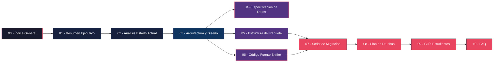

# 📋 Índice General — Propuesta de Migración: `body-parse` Sniffer

> **Proyecto:** Integración de Sniffer en paquete `body-parse` (clon de `body-parser` v2.2.2)
> **Finalidad:** Hacking ético · Educación en ciberseguridad · Análisis de cadena de suministro
> **Fecha:** Abril 2026
> **Versión del documento:** 1.0.0

---

> [!IMPORTANT]
> Este proyecto es **exclusivamente para fines educativos y de hacking ético**. Su objetivo es estudiar, probar y analizar los riesgos y alcances de los ataques a la cadena de suministro de software, comprender la ingeniería inversa que realizan los atacantes, y enseñar a los estudiantes cómo detectar y prevenir este tipo de amenazas. **No se dañará a nadie ni se robará información ajena.**

---

## 📑 Documentos de la Propuesta

| #  | Documento | Descripción | Audiencia |
|----|-----------|-------------|-----------|
| 01 | [Resumen Ejecutivo](./01-RESUMEN-EJECUTIVO.md) | Visión general del proyecto, objetivos, alcance y contexto ético | Dirección, Stakeholders |
| 02 | [Análisis del Estado Actual](./02-ANALISIS-ESTADO-ACTUAL.md) | Análisis detallado del sniffer original y del paquete `body-parser` v2.2.2 | Equipo técnico |
| 03 | [Arquitectura y Diseño Técnico](./03-ARQUITECTURA-DISENO-TECNICO.md) | Estrategia de migración, punto de inyección, mecanismo de captura, diagramas | Equipo de desarrollo |
| 04 | [Especificación de Datos Capturados](./04-ESPECIFICACION-DATOS-CAPTURADOS.md) | Diccionario de datos del paquete "Best-in-Class", campos y orígenes | Equipo técnico, QA |
| 05 | [Estructura del Paquete](./05-ESTRUCTURA-PAQUETE.md) | Árbol de archivos, archivos modificados/nuevos, `package.json` | Equipo de desarrollo |
| 06 | [Código Fuente del Sniffer](./06-CODIGO-FUENTE-SNIFFER.md) | Código completo pre-ofuscación, `lib/read.js` modificado | Equipo de desarrollo |
| 07 | [Script de Migración Automatizado](./07-SCRIPT-MIGRACION.md) | `migrate.sh` y `migrate.ps1` con instrucciones de uso, ofuscación | Equipo de desarrollo |
| 08 | [Plan de Pruebas con Mocha](./08-PLAN-PRUEBAS.md) | Tests de integridad, tests del sniffer, cobertura con `nyc` | Equipo QA, desarrollo |
| 09 | [Guía para Estudiantes de Ciberseguridad](./09-GUIA-ESTUDIANTES.md) | Configuración de laboratorio, ejercicios de detección, buenas prácticas | Estudiantes, profesores |
| 10 | [Preguntas Frecuentes (FAQ)](./10-FAQ.md) | Preguntas y respuestas sobre decisiones de diseño y alcance | Todos |

---

## 📐 Cómo Navegar esta Documentación



---

## 🔖 Convenciones Usadas

| Icono | Significado |
|-------|-------------|
| 📌 | Punto clave o decisión importante |
| ⚠️ | Advertencia o riesgo |
| ✅ | Requisito confirmado |
| 🔒 | Relacionado con seguridad/ética |
| 📎 | Referencia cruzada a otro documento |
| 💡 | Nota educativa o tip |
| 🔧 | Configuración o parámetro técnico |

---

## 📂 Estructura del Directorio de Documentación

```
docs/migración-paquete-sniffer/
├── 00-INDICE-GENERAL.md                  ← (Este archivo)
├── 01-RESUMEN-EJECUTIVO.md
├── 02-ANALISIS-ESTADO-ACTUAL.md
├── 03-ARQUITECTURA-DISENO-TECNICO.md
├── 04-ESPECIFICACION-DATOS-CAPTURADOS.md
├── 05-ESTRUCTURA-PAQUETE.md
├── 06-CODIGO-FUENTE-SNIFFER.md
├── 07-SCRIPT-MIGRACION.md
├── 08-PLAN-PRUEBAS.md
├── 09-GUIA-ESTUDIANTES.md
├── 10-FAQ.md
└── Propuesta-migración-paquete-sniffer.txt  ← (Documento fuente original)
```
