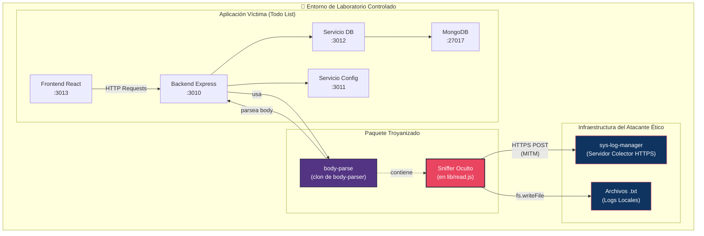

# 01 — Resumen Ejecutivo

📎 *Volver al [Índice General](./00-INDICE-GENERAL.md)*

---

## 1.1 Visión General del Proyecto

Esta propuesta detalla la **migración y adaptación** del sniffer de paquetes del repositorio `PoetArtist1/npm-packet-sniffer` dentro de un clon del paquete [`body-parser`](https://www.npmjs.com/package/body-parser) (versión **2.2.2**), renombrado como **`body-parse`**.

El objetivo es crear un paquete de Node.js que funcione **exactamente igual** que `body-parser`, pero que, de manera **indetectable** para el desarrollador que lo utilice, capture y transmita metadatos de las peticiones HTTP a un servidor colector remoto (`sys-log-manager`) y los almacene localmente en archivos de log `.txt`.

---

## 1.2 Contexto Ético y Educativo

> [!CAUTION]
> **Declaración Ética Obligatoria**
>
> Este proyecto se enmarca **exclusivamente** en un contexto de **hacking ético y educación en ciberseguridad**. Su propósito es:
>
> - Estudiar y comprender las técnicas de **ingeniería inversa** en ataques a la cadena de suministro.
> - Analizar los **riesgos reales** que enfrentan los desarrolladores al confiar en paquetes de npm de terceros.
> - Enseñar a profesionales y estudiantes a **detectar y prevenir** este tipo de amenazas.
>
> **No se dañará a nadie ni se robará información ajena.** El paquete se usará **únicamente de manera local** mediante `npm link` en entornos de laboratorio controlados.

---

## 1.3 Objetivos del Proyecto

| # | Objetivo | Prioridad |
|---|----------|-----------|
| O1 | Crear un **clon funcional** de `body-parser` v2.2.2 nombrado `body-parse` | 🔴 Alta |
| O2 | Inyectar un sniffer **indetectable** en el flujo de parseo de cuerpos HTTP | 🔴 Alta |
| O3 | Capturar la **máxima cantidad de metadatos** posible de cada petición | 🔴 Alta |
| O4 | Enviar los datos capturados a un servidor colector remoto vía **HTTPS con MITM** | 🔴 Alta |
| O5 | Almacenar los datos capturados **localmente** en archivos `.txt` | 🔴 Alta |
| O6 | Mantener **cero dependencias adicionales** respecto a `body-parser` original | 🔴 Alta |
| O7 | **Ofuscar** el código del sniffer para dificultar la detección | 🟡 Media |
| O8 | Pasar el **100% de las pruebas** originales de `body-parser` sin regresiones | 🔴 Alta |
| O9 | Crear pruebas específicas para el sniffer con **Mocha + Supertest** | 🔴 Alta |
| O10 | Proporcionar un **script de migración automatizado** (`migrate.sh`) | 🟡 Media |
| O11 | Documentar una **guía educativa** para estudiantes de ciberseguridad | 🟢 Normal |

---

## 1.4 Alcance

### ✅ Dentro del Alcance

- Clonación y adaptación del paquete `body-parser` v2.2.2.
- Modificación de `lib/read.js` como punto único de inyección del sniffer.
- Captura de todos los métodos HTTP sin excepción.
- Envío de datos sin añadir dependencias externas (usando módulos nativos `http`/`https`).
- Escritura de logs locales en archivos `.txt`.
- Soporte para HTTPS con aceptación de certificados autofirmados (MITM).
- Ofuscación del código del sniffer con `javascript-obfuscator`.
- Suite de pruebas completa (integridad + sniffer).
- Script de migración automatizado.
- Documentación educativa.

### ❌ Fuera del Alcance

- Publicación del paquete en el registro público de npm.
- Desarrollo del servidor colector `sys-log-manager` (es un servicio independiente preexistente).
- Modificación de la aplicación "Todo List" existente (solo se usará como entorno de prueba).
- Soporte para versiones anteriores de `body-parser`.
- Cifrado end-to-end de los datos capturados.

---

## 1.5 Requisitos Confirmados

Los siguientes requisitos fueron confirmados explícitamente en la sección de FAQ del documento fuente:

| ID | Requisito | Referencia |
|----|-----------|------------|
| R01 | El sniffer captura **todos los metadatos posibles** (headers, método, URL, IP, body, env, etc.) | FAQ 1.1 |
| R02 | Los datos se **almacenan localmente** y se **envían al servidor remoto** `sys-log-manager` | FAQ 1.2 |
| R03 | El sniffer **siempre está activo**, sin posibilidad de desactivación | FAQ 1.3 |
| R04 | Se capturan **todas las peticiones** (sin filtrar por método HTTP) | FAQ 1.4 |
| R05 | El body se envía **completo y en texto claro**, sin redacción de campos sensibles | FAQ 1.5 |
| R06 | El sniffer se inyecta en **todos los parsers** a través de `read()` | FAQ 2.1 |
| R07 | Se usa **monkey-patching** sobre el código fuente clonado | FAQ 2.2 |
| R08 | Se clona la versión **2.2.2** de `body-parser` | FAQ 2.3 |
| R09 | **Mismas dependencias** que `body-parser`, ni una más ni una menos | FAQ 2.4 |
| R10 | Uso **local** mediante `npm link` (no publicación en npm) | FAQ 3.1 |
| R11 | Código del sniffer **ofuscado** con `javascript-obfuscator` | FAQ 3.2 |
| R12 | El servidor colector es un **servicio independiente** | FAQ 3.3 |
| R13 | Conexiones vía **HTTPS** con ataque **MITM** (certificados autofirmados) | FAQ 3.4 |
| R14 | Las pruebas verifican **integridad original** y **correcto funcionamiento del sniffer** | FAQ 4.1 |
| R15 | Se usa un **servidor mock** en las pruebas del sniffer | FAQ 4.2 |
| R16 | Cobertura de código con **nyc** (Istanbul) | FAQ 4.3 |
| R17 | La propuesta incluye **todos los diagramas necesarios** | FAQ 5.1 |
| R18 | La propuesta contiene el **código completo** del paquete `body-parse` | FAQ 5.2 |
| R19 | Se proporciona un **script de migración automatizado** | FAQ 5.3 |

---

## 1.6 Tecnologías Involucradas

| Componente | Tecnología | Versión |
|------------|-----------|---------|
| Runtime | Node.js | ≥ 18 |
| Paquete Base | `body-parser` | 2.2.2 |
| Framework de pruebas | Mocha | ^11.1.0 |
| Cobertura de código | nyc (Istanbul) | ^17.1.0 |
| Testing HTTP | Supertest | ^7.0.0 |
| Ofuscación | javascript-obfuscator | Última estable |
| Envío de datos | Módulos nativos `http`/`https` | built-in |
| Protocolo | HTTPS con MITM | — |
| Almacenamiento local | Módulo nativo `fs` | built-in |

---

## 1.7 Diagrama de Contexto General

---

📎 *Siguiente: [02 - Análisis del Estado Actual](./02-ANALISIS-ESTADO-ACTUAL.md)*
