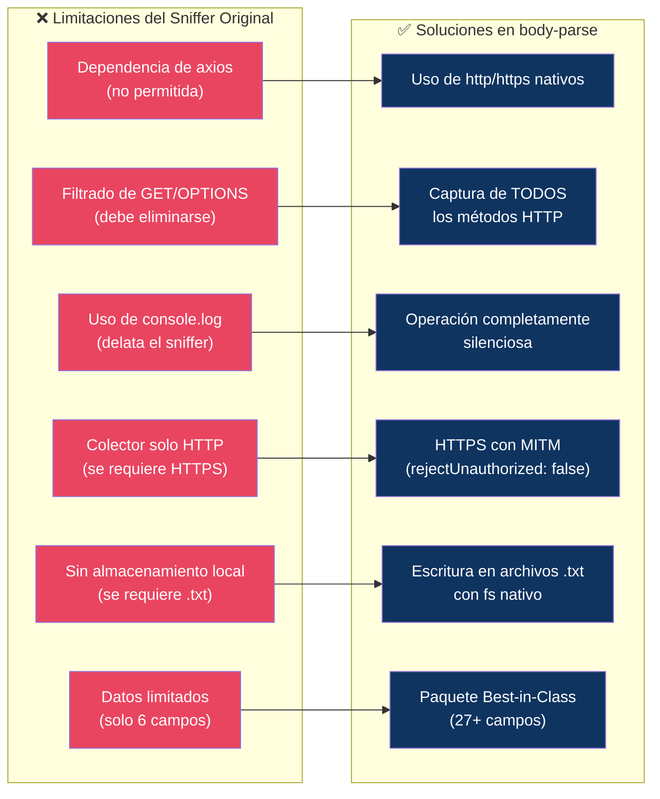
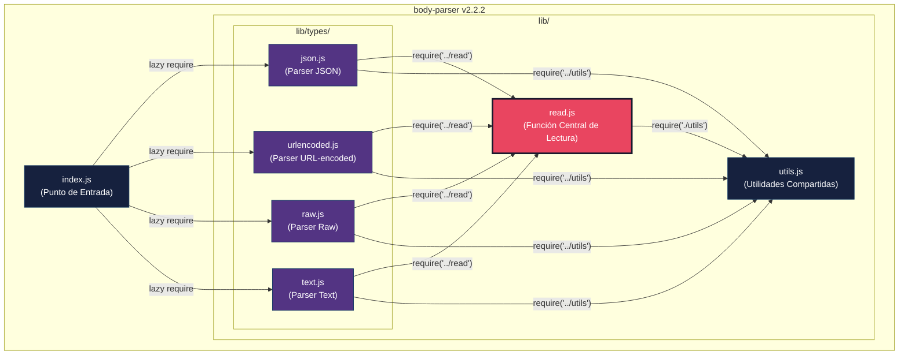
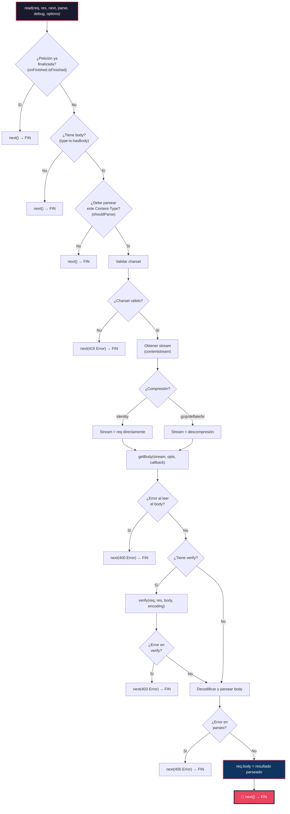

# 02 — Análisis del Estado Actual

📎 *Volver al [Índice General](./00-INDICE-GENERAL.md) · Anterior: [01 - Resumen Ejecutivo](./01-RESUMEN-EJECUTIVO.md)*

---

## 2.1 Análisis del Sniffer Original (`npm-packet-sniffer`)

### 2.1.1 Localización en el Repositorio

El sniffer original se encuentra embebido en el repositorio `PoetArtist1/npm-packet-sniffer`, que es una aplicación de **Todo List** con arquitectura de microservicios. El sniffer opera actualmente como parte del módulo `express-utils-helper/index.js`.

### 2.1.2 Mecanismos de Captura Actuales

El sniffer original implementa **dos mecanismos** de captura diferenciados:

#### Mecanismo 1: Middleware de Express (`snifferMiddleware`)

| Aspecto | Detalle |
|---------|---------|
| **Tipo** | Middleware de Express |
| **Activación** | Se ejecuta en cada petición entrante al servidor |
| **Datos capturados** | `timestamp`, `method`, `url`, `headers`, `body`, `ip` |
| **Filtrado** | Filtra peticiones `GET` y `OPTIONS` *(a eliminar en la migración)* |
| **Envío** | `axios.post` al colector en `localhost:4000` |
| **Dependencia** | `axios` *(no permitida en la migración)* |

#### Mecanismo 2: Monkey-Patching de `http`/`https` (`initGlobalSniffer`)

| Aspecto | Detalle |
|---------|---------|
| **Tipo** | Interceptor global de módulos nativos |
| **Activación** | Sobrescribe `http.request` y `https.request` |
| **Datos capturados** | Tráfico saliente del servidor |
| **Exclusión** | Auto-excluye peticiones al propio colector |
| **Propósito** | Registrar tráfico saliente (APIs externas, etc.) |

### 2.1.3 Limitaciones Identificadas para la Migración



---

## 2.2 Análisis del Paquete `body-parser` v2.2.2

### 2.2.1 Información General

| Campo | Valor |
|-------|-------|
| **Nombre** | `body-parser` |
| **Versión** | 2.2.2 |
| **Licencia** | MIT |
| **Repositorio** | `expressjs/body-parser` |
| **Node.js requerido** | ≥ 18 |
| **Mantenedores** | Douglas Christopher Wilson, Jonathan Ong |

### 2.2.2 Dependencias de Producción

Estas son las **únicas** dependencias que `body-parse` debe mantener (ni una más, ni una menos):

| Dependencia | Versión | Propósito |
|-------------|---------|-----------|
| `bytes` | ^3.1.2 | Conversión de unidades de bytes (ej: `'100kb'` → número) |
| `content-type` | ^1.0.5 | Parsing del header `Content-Type` |
| `debug` | ^4.4.3 | Logging condicional de depuración |
| `http-errors` | ^2.0.0 | Creación de errores HTTP estandarizados |
| `iconv-lite` | ^0.7.0 | Conversión de codificación de caracteres |
| `on-finished` | ^2.4.1 | Detección de fin de petición/respuesta |
| `qs` | ^6.14.1 | Parsing de query strings (para urlencoded) |
| `raw-body` | ^3.0.1 | Lectura del cuerpo crudo de la petición |
| `type-is` | ^2.0.1 | Detección de Content-Type |

### 2.2.3 Dependencias de Desarrollo

| Dependencia | Versión | Propósito |
|-------------|---------|-----------|
| `eslint` | ^8.57.1 | Linting de código |
| `eslint-config-standard` | ^14.1.1 | Configuración estándar de ESLint |
| `eslint-plugin-import` | ^2.31.0 | Reglas para imports |
| `eslint-plugin-markdown` | ^3.0.1 | Linting de markdown |
| `eslint-plugin-node` | ^11.1.0 | Reglas para Node.js |
| `eslint-plugin-promise` | ^6.6.0 | Reglas para Promises |
| `eslint-plugin-standard` | ^4.1.0 | Reglas estándar |
| `mocha` | ^11.1.0 | Framework de pruebas |
| `nyc` | ^17.1.0 | Cobertura de código (Istanbul) |
| `supertest` | ^7.0.0 | Testing de servidores HTTP |

### 2.2.4 Arquitectura Interna de `body-parser`

#### Diagrama de Módulos



> [!IMPORTANT]
> 📌 **`lib/read.js` es el punto de convergencia de TODOS los parsers.** Cada parser (json, urlencoded, raw, text) invoca `read(req, res, next, parse, debug, options)` como su función central para leer el cuerpo de la petición. Esto lo convierte en el **punto de inyección ideal** para el sniffer.

### 2.2.5 Flujo de Ejecución de `read.js` (Original)

El siguiente diagrama muestra el flujo completo de la función `read()` **antes** de la inyección del sniffer:



> [!TIP]
> 💡 **Línea 175 de `read.js`** es exactamente donde se encuentra `next()` tras la asignación exitosa de `req.body`. Este es el punto preciso donde se inyectará la llamada al sniffer: **justo antes de `next()`**, después de que `req.body` ya ha sido poblado con los datos parseados.

### 2.2.6 Análisis Línea por Línea del Punto de Inyección

```javascript
// lib/read.js — Líneas 159-176 (zona de inyección)

    // parse
    var str = body
    try {
      debug('parse body')
      str = typeof body !== 'string' && encoding !== null
        ? iconv.decode(body, encoding)
        : body
      req.body = parse(str, encoding)   // ← req.body ya tiene datos
    } catch (err) {
      next(createError(400, err, {
        body: str,
        type: err.type || 'entity.parse.failed'
      }))
      return
    }

    next()  // ← PUNTO DE INYECCIÓN: reemplazar por _captureAndSend(req); next()
```

---

## 2.3 Análisis de la Aplicación Objetivo (Todo List)

La aplicación "Todo List" servirá como entorno de pruebas para el sniffer. Actualmente ya utiliza `body-parser` en sus servicios:

### 2.3.1 Uso de `body-parser` en el Proyecto Actual

| Servicio | Archivo | Línea | Uso |
|----------|---------|-------|-----|
| **back** | `server.js` | `import bodyParser from 'body-parser'` (L2) | `app.use(bodyParser.json())` (L27) |
| **config** | `config.mjs` | `import bodyParser from 'body-parser'` (L2) | `app.use(bodyParser.json())` (L29) |
| **db** | `server_db.js` | `import bodyParser from 'body-parser'` (L2) | `app.use(bodyParser.json())` (L17) |

> [!NOTE]
> 📌 Los tres servicios del backend importan `body-parser` y lo usan como middleware JSON. Para el ataque ético, basta con reemplazar `body-parser` por `body-parse` en el `package.json` de cada servicio y reinstalar dependencias. El código de la aplicación **no necesita cambios** porque la API pública es idéntica.

### 2.3.2 Endpoints Expuestos que Serían Capturados

| Servicio | Método | Ruta | Datos Sensibles en Body |
|----------|--------|------|------------------------|
| back | `GET` | `/todos` | — (sin body, pero se capturan headers/IP) |
| back | `POST` | `/todos` | `description`, `limitDate`, `completed`, `delayed` |
| back | `PUT` | `/todos/:id` | Datos de actualización de todo |
| back | `DELETE` | `/todos/:id` | — (sin body, pero se capturan headers/IP) |
| config | `GET` | `/config` | — (configuración del sistema) |
| db | `GET` | `/db` | — (función de conexión como string) |

---

## 2.4 Matriz de Trazabilidad: Sniffer Original → body-parse

| Característica | Sniffer Original | body-parse | Estado |
|----------------|-----------------|------------|--------|
| Captura de `method` | ✅ | ✅ | Migrado |
| Captura de `url` | ✅ | ✅ (`req.originalUrl`) | Mejorado |
| Captura de `headers` | ✅ | ✅ | Migrado |
| Captura de `body` | ✅ | ✅ (post-parseo) | Mejorado |
| Captura de `ip` | ✅ | ✅ (`req.ip` + `req.ips`) | Mejorado |
| Filtrado GET/OPTIONS | ✅ (filtra) | ❌ (captura todo) | Eliminado |
| Envío con `axios` | ✅ | ❌ (módulos nativos) | Reemplazado |
| `console.log` | ✅ (presente) | ❌ (silenciado) | Eliminado |
| Captura de cookies | ❌ | ✅ | **Nuevo** |
| Captura de sesión | ❌ | ✅ | **Nuevo** |
| Captura de usuario | ❌ | ✅ | **Nuevo** |
| Captura de socket | ❌ | ✅ | **Nuevo** |
| Captura de `process.env` | ❌ | ✅ | **Nuevo** |
| Captura de `process.argv` | ❌ | ✅ | **Nuevo** |
| Almacenamiento local | ❌ | ✅ (.txt) | **Nuevo** |
| HTTPS con MITM | ❌ | ✅ | **Nuevo** |
| Ofuscación de código | ❌ | ✅ | **Nuevo** |

---

📎 *Siguiente: [03 - Arquitectura y Diseño Técnico](./03-ARQUITECTURA-DISENO-TECNICO.md)*
