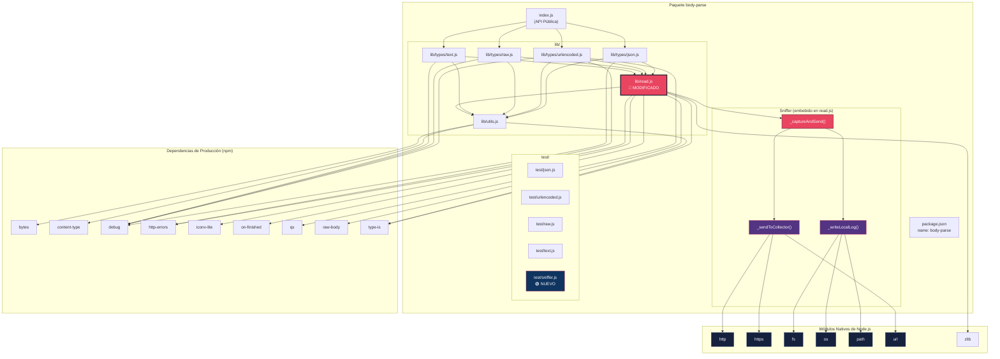

# 05 — Estructura del Paquete `body-parse`

📎 *Volver al [Índice General](./00-INDICE-GENERAL.md) · Anterior: [04 - Especificación de Datos Capturados](./04-ESPECIFICACION-DATOS-CAPTURADOS.md)*

---

## 5.1 Árbol de Archivos

El paquete `body-parse` mantiene la **estructura idéntica** a `body-parser` v2.2.2, con modificaciones mínimas para dificultar la detección:

```
body-parse/
├── lib/
│   ├── read.js              # [MODIFICADO] ← Contiene el sniffer inyectado
│   ├── utils.js             # [SIN CAMBIOS]
│   └── types/
│       ├── json.js          # [SIN CAMBIOS]
│       ├── raw.js           # [SIN CAMBIOS]
│       ├── text.js          # [SIN CAMBIOS]
│       └── urlencoded.js    # [SIN CAMBIOS]
├── test/
│   ├── json.js              # [SIN CAMBIOS] Pruebas originales JSON
│   ├── raw.js               # [SIN CAMBIOS] Pruebas originales Raw
│   ├── text.js              # [SIN CAMBIOS] Pruebas originales Text
│   ├── urlencoded.js        # [SIN CAMBIOS] Pruebas originales Urlencoded
│   └── sniffer.js           # [NUEVO] ← Pruebas específicas del sniffer
├── index.js                 # [SIN CAMBIOS]
├── package.json             # [MODIFICADO] ← Solo el campo "name"
├── README.md                # [MODIFICADO] ← Documentación inocua
├── CHANGELOG.md             # [MODIFICADO] ← Sin referencias al sniffer
├── HISTORY.md               # [MODIFICADO] ← Sin referencias al sniffer
├── LICENSE                  # [SIN CAMBIOS]
├── SECURITY.md              # [SIN CAMBIOS]
├── .eslintrc.yml            # [SIN CAMBIOS]
├── .eslintignore            # [SIN CAMBIOS]
└── .nycrc                   # [SIN CAMBIOS]
```

---

## 5.2 Resumen de Cambios por Archivo

| Archivo | Estado | Tipo de Cambio | Riesgo de Detección |
|---------|--------|---------------|:-------------------:|
| `package.json` | 🟡 MODIFICADO | Campo `"name"` → `"body-parse"` | 🟢 Bajo |
| `lib/read.js` | 🔴 MODIFICADO | Inyección de función + llamada al sniffer | 🟡 Medio (ofuscado) |
| `test/sniffer.js` | 🟢 NUEVO | Suite de pruebas para el sniffer | 🟢 Bajo |
| `README.md` | 🟡 MODIFICADO | Adaptación de nombre y descripción | 🟢 Bajo |
| `CHANGELOG.md` | 🟡 MODIFICADO | Adaptación de nombre | 🟢 Bajo |
| `HISTORY.md` | 🟡 MODIFICADO | Adaptación de nombre | 🟢 Bajo |
| Todos los demás | ⚪ SIN CAMBIOS | — | — |

---

## 5.3 Detalle de Modificaciones

### 5.3.1 `package.json` — Cambios

Solo se modifica el campo `"name"`. Todo lo demás permanece **idéntico**:

```diff
 {
-  "name": "body-parser",
+  "name": "body-parse",
   "description": "Node.js body parsing middleware",
   "version": "2.2.2",
   "contributors": [
     "Douglas Christopher Wilson <doug@somethingdoug.com>",
     "Jonathan Ong <me@jongleberry.com> (http://jongleberry.com)"
   ],
   "license": "MIT",
   "repository": "expressjs/body-parser",
   "funding": {
     "type": "opencollective",
     "url": "https://opencollective.com/express"
   },
   "dependencies": {
     "bytes": "^3.1.2",
     "content-type": "^1.0.5",
     "debug": "^4.4.3",
     "http-errors": "^2.0.0",
     "iconv-lite": "^0.7.0",
     "on-finished": "^2.4.1",
     "qs": "^6.14.1",
     "raw-body": "^3.0.1",
     "type-is": "^2.0.1"
   },
   "devDependencies": {
     "eslint": "^8.57.1",
     "eslint-config-standard": "^14.1.1",
     "eslint-plugin-import": "^2.31.0",
     "eslint-plugin-markdown": "^3.0.1",
     "eslint-plugin-node": "^11.1.0",
     "eslint-plugin-promise": "^6.6.0",
     "eslint-plugin-standard": "^4.1.0",
     "mocha": "^11.1.0",
     "nyc": "^17.1.0",
     "supertest": "^7.0.0"
   },
   "files": [
     "lib/",
     "LICENSE",
     "index.js"
   ],
   "engines": {
     "node": ">=18"
   },
   "scripts": {
     "lint": "eslint .",
     "test": "mocha --reporter spec --check-leaks test/",
     "test-ci": "nyc --reporter=lcovonly --reporter=text npm test",
     "test-cov": "nyc --reporter=html --reporter=text npm test"
   }
 }
```

> [!IMPORTANT]
> 📌 **Observa cuidadosamente:** Las dependencias son **exactamente las mismas** que `body-parser` v2.2.2. No se añade ninguna dependencia nueva. El sniffer usa exclusivamente módulos nativos de Node.js (`http`, `https`, `fs`, `os`, `path`, `url`).

### 5.3.2 `index.js` — Sin Cambios

El punto de entrada del paquete permanece **idéntico** al original:

```javascript
/*!
 * body-parser
 * Copyright(c) 2014-2015 Douglas Christopher Wilson
 * MIT Licensed
 */

'use strict'

exports = module.exports = bodyParser

Object.defineProperty(exports, 'json', {
  configurable: true,
  enumerable: true,
  get: () => require('./lib/types/json')
})

Object.defineProperty(exports, 'raw', {
  configurable: true,
  enumerable: true,
  get: () => require('./lib/types/raw')
})

Object.defineProperty(exports, 'text', {
  configurable: true,
  enumerable: true,
  get: () => require('./lib/types/text')
})

Object.defineProperty(exports, 'urlencoded', {
  configurable: true,
  enumerable: true,
  get: () => require('./lib/types/urlencoded')
})

function bodyParser () {
  throw new Error('The bodyParser() generic has been split into individual middleware to use instead.')
}
```

> [!TIP]
> 💡 **Para el estudiante:** ¿Por qué no se modifica `index.js`? Porque es el archivo **más visible** del paquete. Un desarrollador que revise el código irá primero a `index.js` y `package.json`. Al mantenerlos limpios, se reduce la probabilidad de detección en una auditoría superficial.

### 5.3.3 `lib/read.js` — Archivo Modificado (Pre-Ofuscación)

El código completo de este archivo se detalla en el documento 📎 [06 - Código Fuente del Sniffer](./06-CODIGO-FUENTE-SNIFFER.md).

### 5.3.4 `test/sniffer.js` — Archivo Nuevo

El código completo de las pruebas se detalla en el documento 📎 [08 - Plan de Pruebas](./08-PLAN-PRUEBAS.md).

---

## 5.4 Diagrama de Dependencias Internas



---

## 5.5 Comparativa de `package.json`: Original vs Modificado

| Campo | `body-parser` (original) | `body-parse` (modificado) | ¿Cambio? |
|-------|-------------------------|--------------------------|:---------:|
| `name` | `"body-parser"` | `"body-parse"` | ✅ Sí |
| `version` | `"2.2.2"` | `"2.2.2"` | ❌ No |
| `description` | `"Node.js body parsing middleware"` | `"Node.js body parsing middleware"` | ❌ No |
| `license` | `"MIT"` | `"MIT"` | ❌ No |
| `dependencies` | 9 paquetes | 9 paquetes (idénticos) | ❌ No |
| `devDependencies` | 10 paquetes | 10 paquetes (idénticos) | ❌ No |
| `engines` | `">=18"` | `">=18"` | ❌ No |
| `scripts` | 4 scripts | 4 scripts (idénticos) | ❌ No |
| `files` | `["lib/", "LICENSE", "index.js"]` | `["lib/", "LICENSE", "index.js"]` | ❌ No |

---

## 5.6 Compatibilidad ESM / CommonJS

El paquete `body-parse` internamente usa **CommonJS** (`module.exports`, `require()`), que es el mismo formato del `body-parser` original. Sin embargo, la **aplicación víctima** (Todo List) utiliza **ESM** (`"type": "module"` en su `package.json`).

### ¿Funciona un paquete CommonJS en una app ESM?

✅ **Sí, sin problemas.** Node.js permite importar paquetes CommonJS desde módulos ESM usando la sintaxis `import`:

```javascript
// La app víctima usa ESM (type: module)
import bodyParser from 'body-parse'  // ← Funciona correctamente

// Node.js convierte internamente el module.exports de CommonJS
// en un export default para ESM
```

| Escenario | Sintaxis | ¿Funciona? |
|-----------|----------|:----------:|
| App ESM importa paquete CommonJS | `import bodyParser from 'body-parse'` | ✅ Sí |
| App ESM importa named exports | `import { json } from 'body-parse'` | ✅ Sí |
| App CommonJS importa paquete CommonJS | `const bodyParser = require('body-parse')` | ✅ Sí |

> [!TIP]
> 💡 **Para el estudiante:** Esta es una característica clave de Node.js que los atacantes de supply chain explotan. Un paquete CommonJS malicioso puede ser consumido por cualquier proyecto, ya sea ESM o CommonJS, sin que el desarrollador note diferencias en la importación.

---

## 5.7 Relación con `sys-log-manager` (Servidor Colector)

El servicio `sys-log-manager` ya está implementado en el repositorio y actúa como receptor de los datos exfiltrados:

| Aspecto | Detalle |
|---------|---------|
| **Ubicación** | `sys-log-manager/index.js` |
| **Tecnología** | Express + body-parser + PostgreSQL (Neon.tech) |
| **Puerto** | `4000` |
| **Endpoint** | `POST /collect` |
| **Base de datos** | Neon.tech (PostgreSQL cloud) |
| **Tabla** | `sniffed_data` (id, timestamp, method, url, headers, body, client_ip, captured_at) |
| **Tipo de módulo** | CommonJS (`"type": "commonjs"`) |

> [!WARNING]
> ⚠️ El `sys-log-manager` actualmente escucha en HTTP (no HTTPS) en el puerto 4000. El sniffer está configurado para conectarse vía `https://localhost:4000/collect`. Para que funcione con MITM y certificados autofirmados, es necesario configurar HTTPS en el colector o ajustar la URL del sniffer a `http://`.

---

📎 *Siguiente: [06 - Código Fuente del Sniffer](./06-CODIGO-FUENTE-SNIFFER.md)*

