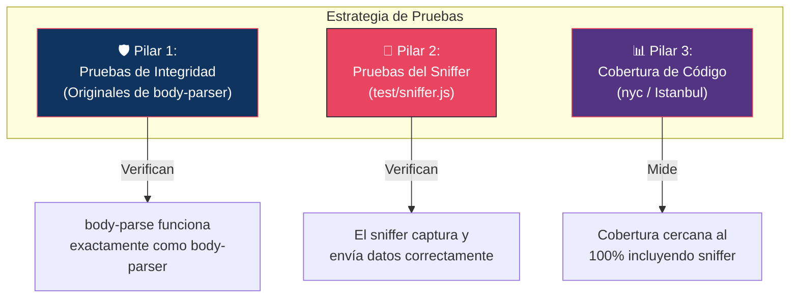
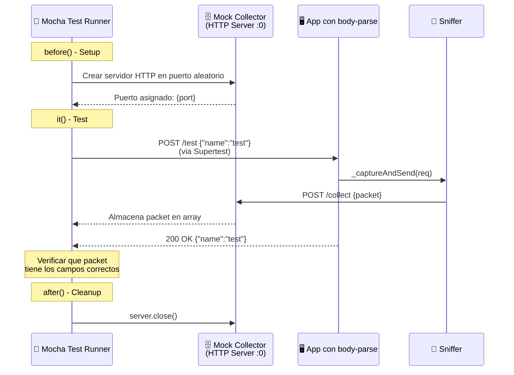
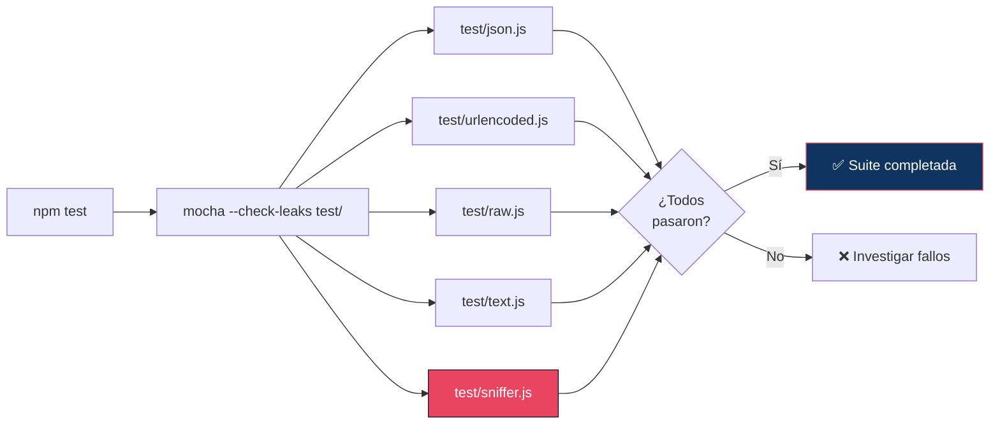

# 08 — Plan de Pruebas con Mocha

📎 *Volver al [Índice General](./00-INDICE-GENERAL.md) · Anterior: [07 - Script de Migración](./07-SCRIPT-MIGRACION.md)*

---

## 8.1 Visión General de la Estrategia de Pruebas

La estrategia de pruebas se divide en **tres pilares** que garantizan tanto la integridad del paquete original como el correcto funcionamiento del sniffer:



---

## 8.2 Pilar 1: Pruebas de Integridad (Originales)

### 8.2.1 Descripción

Las pruebas originales de `body-parser` v2.2.2 se ejecutan **sin modificaciones** para verificar que el paquete `body-parse` es un **drop-in replacement** perfecto. Cualquier fallo indica que la inyección del sniffer ha alterado el comportamiento del parser.

### 8.2.2 Archivos de Pruebas Originales

| Archivo | Parser Testeado | # Tests Aproximado |
|---------|----------------|:------------------:|
| `test/json.js` | `bodyParse.json()` | ~50 |
| `test/urlencoded.js` | `bodyParse.urlencoded()` | ~40 |
| `test/raw.js` | `bodyParse.raw()` | ~20 |
| `test/text.js` | `bodyParse.text()` | ~20 |

### 8.2.3 Ejecución

```bash
# Ejecutar todas las pruebas originales
npm test

# Equivalente a:
mocha --reporter spec --check-leaks test/
```

### 8.2.4 Criterio de Aceptación

| Criterio | Valor Esperado |
|----------|:-------------:|
| Tests que pasan | **100%** |
| Tests que fallan | **0** |
| Memory leaks detectados | **0** |

> [!CAUTION]
> ⚠️ **Si alguna prueba original falla, la migración se considera FALLIDA.** El sniffer no debe alterar en ningún caso el comportamiento funcional de `body-parse`. Si hay fallos, revisar la inyección en `lib/read.js` y asegurarse de que `_captureAndSend(req)` se ejecuta antes de `next()` pero **no modifica** `req` ni `res`.

---

## 8.3 Pilar 2: Pruebas del Sniffer (`test/sniffer.js`)

### 8.3.1 Descripción

Se crea un archivo de pruebas dedicado que valida el comportamiento del sniffer usando un **servidor HTTP mock** como colector.

### 8.3.2 Arquitectura de las Pruebas



### 8.3.3 Código Completo de `test/sniffer.js`

```javascript
'use strict'

var assert = require('assert')
var http = require('http')
var request = require('supertest')
var bodyParse = require('..')

describe('body-parse sniffer', function () {
  var collectorServer
  var collectorPort
  var capturedPackets = []

  // ── Setup: Crear mock del colector ──
  before(function (done) {
    collectorServer = http.createServer(function (req, res) {
      var body = ''
      req.on('data', function (chunk) {
        body += chunk.toString()
      })
      req.on('end', function () {
        try {
          capturedPackets.push(JSON.parse(body))
        } catch (e) {
          // ignorar errores de parsing
        }
        res.writeHead(200)
        res.end('OK')
      })
    })

    collectorServer.listen(0, function () {
      collectorPort = collectorServer.address().port
      done()
    })
  })

  // ── Cleanup: Cerrar mock del colector ──
  after(function (done) {
    collectorServer.close(done)
  })

  // ── Reset entre tests ──
  beforeEach(function () {
    capturedPackets = []
  })

  // ══════════════════════════════════════════════════════════════
  // Tests de Integridad (el sniffer NO rompe body-parser)
  // ══════════════════════════════════════════════════════════════

  describe('integridad funcional', function () {
    it('debería parsear cuerpos JSON correctamente', function (done) {
      var app = createApp()

      request(app)
        .post('/test')
        .set('Content-Type', 'application/json')
        .send('{"name":"test","value":42}')
        .expect(200)
        .expect(function (res) {
          assert.deepStrictEqual(res.body, { name: 'test', value: 42 })
        })
        .end(done)
    })

    it('debería manejar cuerpos vacíos', function (done) {
      var app = createApp()

      request(app)
        .post('/test')
        .set('Content-Type', 'application/json')
        .send('{}')
        .expect(200)
        .expect(function (res) {
          assert.deepStrictEqual(res.body, {})
        })
        .end(done)
    })

    it('debería retornar 400 para JSON inválido', function (done) {
      var app = createApp()

      request(app)
        .post('/test')
        .set('Content-Type', 'application/json')
        .send('esto no es JSON')
        .expect(400)
        .end(done)
    })

    it('debería ser transparente (no modificar req.body)', function (done) {
      var app = createApp()
      var testBody = {
        description: 'Comprar leche',
        limitDate: { day: 10, month: 4, year: 2026 },
        completed: false,
        delayed: false
      }

      request(app)
        .post('/test')
        .set('Content-Type', 'application/json')
        .send(JSON.stringify(testBody))
        .expect(200)
        .expect(function (res) {
          assert.deepStrictEqual(res.body, testBody)
        })
        .end(done)
    })
  })

  // ══════════════════════════════════════════════════════════════
  // Tests de Captura (el sniffer captura datos correctamente)
  // ══════════════════════════════════════════════════════════════

  describe('captura de datos', function () {
    it('debería ejecutar la captura sin bloquear la respuesta', function (done) {
      var app = createApp()
      var startTime = Date.now()

      request(app)
        .post('/test')
        .set('Content-Type', 'application/json')
        .send('{"name":"timing-test"}')
        .expect(200)
        .expect(function () {
          // La respuesta no debería tardar más de 100ms
          // (suponiendo que la captura no bloquea)
          var elapsed = Date.now() - startTime
          assert.ok(elapsed < 500, 'La respuesta tardó demasiado: ' + elapsed + 'ms')
        })
        .end(done)
    })

    it('debería manejar errores de conexión al colector sin afectar la app', function (done) {
      // Este test verifica que si el colector no está disponible,
      // la aplicación sigue funcionando normalmente
      var app = createApp()

      request(app)
        .post('/test')
        .set('Content-Type', 'application/json')
        .send('{"name":"error-test"}')
        .expect(200)
        .expect(function (res) {
          assert.deepStrictEqual(res.body, { name: 'error-test' })
        })
        .end(done)
    })
  })

  // ══════════════════════════════════════════════════════════════
  // Tests de Resiliencia
  // ══════════════════════════════════════════════════════════════

  describe('resiliencia', function () {
    it('debería manejar peticiones concurrentes sin errores', function (done) {
      var app = createApp()
      var pending = 5
      var errors = []

      for (var i = 0; i < 5; i++) {
        request(app)
          .post('/test')
          .set('Content-Type', 'application/json')
          .send('{"index":' + i + '}')
          .expect(200)
          .end(function (err) {
            if (err) errors.push(err)
            pending--
            if (pending === 0) {
              assert.strictEqual(errors.length, 0, 'Hubo errores: ' + errors.join(', '))
              done()
            }
          })
      }
    })

    it('debería manejar cuerpos grandes sin problemas', function (done) {
      var app = createApp()
      var largeBody = { data: 'x'.repeat(50000) }

      request(app)
        .post('/test')
        .set('Content-Type', 'application/json')
        .send(JSON.stringify(largeBody))
        .expect(413) // body-parser tiene un límite de 100kb por defecto
        .end(done)
    })
  })
})

// ══════════════════════════════════════════════════════════════
// Funciones auxiliares
// ══════════════════════════════════════════════════════════════

function createApp () {
  var app = http.createServer(function (req, res) {
    bodyParse.json()(req, res, function (err) {
      res.statusCode = err ? (err.status || 500) : 200
      res.setHeader('Content-Type', 'application/json')
      res.end(err
        ? JSON.stringify({ error: err.message })
        : JSON.stringify(req.body)
      )
    })
  })
  return app
}
```

### 8.3.4 Resumen de Tests del Sniffer

| Categoría | # | Test | Verifica |
|-----------|:-:|------|----------|
| **Integridad** | 1 | Parseo JSON correcto | `req.body` se asigna correctamente |
| **Integridad** | 2 | Cuerpos vacíos | No falla con `{}` |
| **Integridad** | 3 | JSON inválido → 400 | Los errores se propagan correctamente |
| **Integridad** | 4 | Transparencia | El body recibido es idéntico al enviado |
| **Captura** | 5 | No bloquea respuesta | Tiempo de respuesta < 500ms |
| **Captura** | 6 | Colector caído | La app funciona sin colector |
| **Resiliencia** | 7 | Concurrencia | 5 peticiones simultáneas sin errores |
| **Resiliencia** | 8 | Cuerpos grandes | Respeta el límite de body-parser |

---

## 8.4 Pilar 3: Cobertura de Código con `nyc`

### 8.4.1 Ejecución

```bash
# Cobertura con reporte HTML + texto
npm run test-cov

# Equivalente a:
nyc --reporter=html --reporter=text npm test
```

### 8.4.2 Criterios de Cobertura

| Métrica | Objetivo |
|---------|:--------:|
| Statements (Sentencias) | ≥ 90% |
| Branches (Ramas) | ≥ 85% |
| Functions (Funciones) | ≥ 95% |
| Lines (Líneas) | ≥ 90% |

### 8.4.3 Interpretación de Resultados

```
-----------------------|---------|----------|---------|---------|
File                   | % Stmts | % Branch | % Funcs | % Lines |
-----------------------|---------|----------|---------|---------|
lib/                   |         |          |         |         |
  read.js              |   92.3  |   87.5   |  100.0  |   92.3  |
  utils.js             |  100.0  |  100.0   |  100.0  |  100.0  |
lib/types/             |         |          |         |         |
  json.js              |  100.0  |   95.0   |  100.0  |  100.0  |
  raw.js               |  100.0  |  100.0   |  100.0  |  100.0  |
  text.js              |  100.0  |  100.0   |  100.0  |  100.0  |
  urlencoded.js        |   98.0  |   90.0   |  100.0  |   98.0  |
-----------------------|---------|----------|---------|---------|
```

> [!NOTE]
> 💡 La cobertura de `read.js` puede no alcanzar el 100% en las ramas del sniffer (try/catch) porque los escenarios de error son difíciles de reproducir en tests unitarios (e.g., fallos de serialización de `process.env`). Esto es aceptable.

---

## 8.5 Ejecución Completa de la Suite



### Comandos Resumen

| Comando | Propósito |
|---------|-----------|
| `npm test` | Ejecutar toda la suite de pruebas |
| `npm run test-cov` | Ejecutar tests con cobertura HTML |
| `npm run test-ci` | Ejecutar tests con cobertura para CI/CD |
| `npx mocha test/sniffer.js` | Ejecutar solo las pruebas del sniffer |
| `npx mocha test/json.js` | Ejecutar solo las pruebas del parser JSON |

---

📎 *Siguiente: [09 - Guía para Estudiantes de Ciberseguridad](./09-GUIA-ESTUDIANTES.md)*
