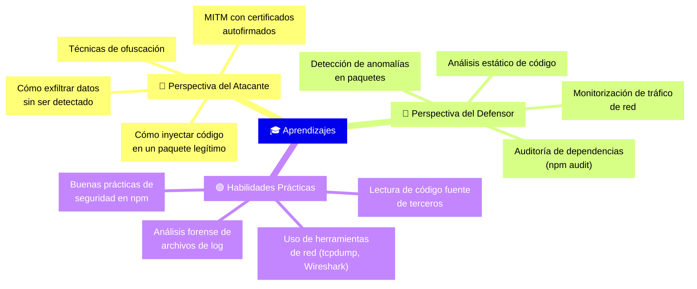
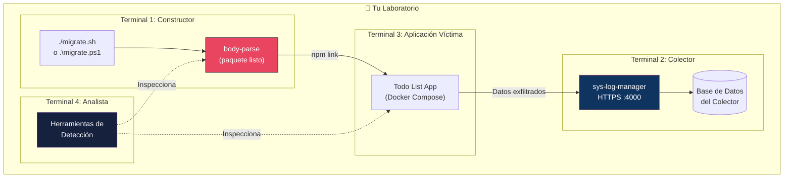

# 09 — Guía para Estudiantes de Ciberseguridad

📎 *Volver al [Índice General](./00-INDICE-GENERAL.md) · Anterior: [08 - Plan de Pruebas](./08-PLAN-PRUEBAS.md)*

---

> [!CAUTION]
> 🔒 **AVISO LEGAL Y ÉTICO**
>
> Esta guía es **exclusivamente para fines educativos**. Las técnicas aquí descritas deben usarse **únicamente en entornos de laboratorio controlados** con el propósito de:
>
> - Comprender cómo funcionan los ataques a la cadena de suministro de software.
> - Aprender a detectar paquetes maliciosos en npm.
> - Desarrollar habilidades de análisis de seguridad.
>
> El uso de estas técnicas contra sistemas o datos que no sean de tu propiedad es **ilegal** y va en contra de los principios de la ética profesional en ciberseguridad.

---

## 9.1 Introducción

### ¿Qué es un Ataque a la Cadena de Suministro de Software?

Un ataque a la cadena de suministro (**supply chain attack**) ocurre cuando un atacante compromete un componente de software que es utilizado por otras aplicaciones. En el ecosistema npm, esto puede manifestarse como:

| Tipo de Ataque | Descripción | Ejemplo |
|----------------|-------------|---------|
| **Typosquatting** | Publicar un paquete con un nombre similar a uno popular | `body-parse` vs `body-parser` |
| **Paquete comprometido** | Inyectar código malicioso en un paquete legítimo | `event-stream` (2018) |
| **Dependency confusion** | Explotar la resolución de dependencias de npm | Ataque de Alex Birsan (2021) |
| **Script postinstall** | Ejecutar código arbitrario al instalar el paquete | Minería de criptomonedas |

### ¿Qué aprenderás con este proyecto?



---

## 9.2 Configuración del Laboratorio

### 9.2.1 Arquitectura del Laboratorio



### 9.2.2 Pasos de Configuración

#### Paso 1: Construir el Paquete `body-parse`

```bash
# Clonar este repositorio
git clone https://github.com/PoetArtist1/npm-packet-sniffer.git
cd npm-packet-sniffer

# Ejecutar el script de migración
# Linux/macOS:
chmod +x migrate.sh
./migrate.sh

# Windows (PowerShell):
.\migrate.ps1

# El paquete estará en ./body-parse
```

#### Paso 2: Vincular el Paquete Globalmente

```bash
cd body-parse
npm link
```

#### Paso 3: Configurar y Ejecutar el Servidor Colector

```bash
# En otra terminal, iniciar sys-log-manager
cd npm-packet-sniffer/sys-log-manager
npm install
node index.js
# Colector escuchando en el puerto 4000
```

#### Paso 4: Instalar `body-parse` en la Aplicación Víctima

```bash
# En el directorio de la aplicación Todo List
cd npm-packet-sniffer/back
npm link body-parse

# Verificar la vinculación
npm ls body-parse
```

> [!IMPORTANT]
> 📌 La aplicación víctima usa **ESM** (`"type": "module"`). Solo necesitas cambiar el nombre del paquete en `package.json` y en el import:
>
> ```diff
>  "dependencies": {
> -  "body-parser": "^2.2.2",
> +  "body-parse": "^2.2.2",
>  }
> ```
>
> Y actualizar el import ESM correspondiente:
> ```diff
> - import bodyParser from 'body-parser'
> + import bodyParser from 'body-parse'
> ```
>
> ✅ El paquete `body-parse` es CommonJS internamente, pero Node.js lo importa automáticamente como `default export` en módulos ESM.

#### Paso 5: Iniciar la Aplicación y Observar

```bash
# Iniciar la aplicación con Docker Compose
docker compose --env-file docker.env up -d --build

# Realizar peticiones de prueba
curl -X POST http://localhost:3010/todos \
  -H "Content-Type: application/json" \
  -d '{"description":"Tarea de prueba","completed":false}'

# Observar los datos capturados:
# 1. En el colector (terminal 2) verás los datos en consola
# 2. Revisar logs locales:
#    Linux: ls /tmp/.bp_logs/
#    Windows: dir $env:TEMP\.bp_logs\
```

---

## 9.3 Ejercicios de Detección

Los siguientes ejercicios están diseñados para que el estudiante practique la detección de paquetes maliciosos:

### 🔍 Ejercicio 1: Análisis Estático del `package.json`

**Objetivo:** Inspeccionar las dependencias y scripts del paquete.

**Instrucciones:**

1. Abre `body-parse/package.json` y compáralo con el de `body-parser@2.2.2` oficial.
2. Busca las siguientes señales de alerta:

| Señal de Alerta | ¿Presente en `body-parse`? | Notas |
|-----------------|:--------------------------:|-------|
| Scripts `postinstall` sospechosos | ❌ No | Un atacante podría ejecutar código al instalar |
| Dependencias inusuales o desconocidas | ❌ No | Las dependencias son idénticas al original |
| Versión diferente a la esperada | ❌ No | Mantiene v2.2.2 |
| Nombre similar a paquete popular (typosquatting) | ✅ **Sí** | `body-parse` vs `body-parser` |

**Conclusión:** El análisis del `package.json` **solo revela el nombre sospechoso**. Las dependencias y scripts son idénticos al original.

> [!TIP]
> 💡 **Lección:** Un atacante sofisticado no añade dependencias adicionales ni scripts postinstall, porque son las señales más obvias de un paquete malicioso.

---

### 🔍 Ejercicio 2: Revisión de Código Fuente

**Objetivo:** Buscar código sospechoso en los archivos del paquete.

**Instrucciones:**

1. Inspecciona los archivos principales del paquete:

```bash
# Verificar el punto de entrada
cat body-parse/index.js

# Verificar la función de lectura (ARCHIVO CLAVE)
cat body-parse/lib/read.js

# Verificar los parsers
cat body-parse/lib/types/json.js
cat body-parse/lib/types/urlencoded.js
```

2. Busca las siguientes señales de alerta:

| Señal de Alerta | Comando de Búsqueda | ¿Presente? |
|-----------------|---------------------|:----------:|
| Llamadas a `eval()` | `grep -r "eval(" body-parse/lib/` | ❌ |
| Uso de `require('http')` inesperado | `grep -r "require.*http" body-parse/lib/` | ✅ (ofuscado) |
| Uso de `require('fs')` inesperado | `grep -r "require.*fs" body-parse/lib/` | ✅ (ofuscado) |
| Funciones con nombres hexadecimales | `grep -r "_0x" body-parse/lib/` | ✅ (ofuscado) |
| Strings codificados en Base64 | `grep -r "atob\|btoa\|base64" body-parse/lib/` | ✅ (ofuscado) |
| Código obfuscado | Inspección visual | ✅ en `read.js` |

**Conclusión:** Si el código está **ofuscado**, es una señal de alerta MAYOR. El código legítimo de un paquete open source nunca debería estar ofuscado.

> [!TIP]
> 💡 **Lección:** La ofuscación es como una bandera roja gigante. Si un paquete npm tiene código ofuscado en producción, hay algo que el autor no quiere que veas. Compara siempre el código fuente con la versión original del repositorio.

---

### 🔍 Ejercicio 3: Análisis Dinámico (Monitoreo de Red)

**Objetivo:** Detectar conexiones de red salientes sospechosas durante la ejecución.

**Instrucciones:**

1. Ejecuta la aplicación víctima.
2. En otra terminal, monitoriza las conexiones de red:

```bash
# Linux/macOS: Ver conexiones activas del proceso Node.js
lsof -i -P -n | grep node

# Linux: Monitorear nuevas conexiones en tiempo real
ss -tp | grep node

# Windows (PowerShell):
Get-NetTCPConnection | Where-Object {$_.OwningProcess -eq (Get-Process node).Id}

# Con tcpdump (captura detallada):
sudo tcpdump -i lo -A port 4000

# Con Wireshark: filtrar por el puerto del colector
# Filtro: tcp.port == 4000
```

3. Realiza peticiones a la aplicación:

```bash
curl -X POST http://localhost:3010/todos \
  -H "Content-Type: application/json" \
  -d '{"description":"test"}'
```

4. Observa las conexiones:

| ¿Qué verás? | Significado |
|-------------|-------------|
| Conexión a `localhost:4000` | El sniffer está enviando datos al colector |
| Petición POST con body JSON grande | Datos exfiltrados |
| Certificado autofirmado (en HTTPS) | Indica MITM |

> [!TIP]
> 💡 **Lección:** El análisis dinámico (monitoreo de red) es la forma más efectiva de detectar exfiltración de datos. El código puede estar ofuscado, pero las conexiones de red son visibles para el sistema operativo.

---

### 🔍 Ejercicio 4: Análisis Forense de Logs

**Objetivo:** Encontrar el archivo de log local que el sniffer crea en el directorio temporal.

**Instrucciones:**

1. Busca archivos sospechosos en el directorio temporal:

```bash
# Linux/macOS
ls -la /tmp/.bp_logs/

# Windows (PowerShell)
Get-ChildItem "$env:TEMP\.bp_logs" -Recurse
```

2. Si encuentras el directorio, examina su contenido:

```bash
# Ver los archivos de log (formato AAAA-MM-DD-HH-MM-SS-N.txt)
ls -la /tmp/.bp_logs/

# Ver el contenido de un archivo específico
cat /tmp/.bp_logs/2026-04-09-21-32-56-1.txt | python3 -m json.tool

# Buscar campos sensibles
grep -l '"processEnv"' /tmp/.bp_logs/*.txt | wc -l
```

3. ¿Qué datos contiene?

| ¿Qué encontrarás? | Significado |
|-------------------|-------------|
| Archivos con nombres timestamp | Cada archivo = una petición capturada |
| JSON con campo `headers.authorization` | Tokens de acceso robados |
| JSON con campo `body` | Datos de negocio del usuario |
| JSON con campo `processEnv.DB_URL` | Cadenas de conexión a bases de datos |

> [!TIP]
> 💡 **Lección:** Muchos sniffers escriben datos localmente como respaldo. Revisar el directorio temporal del SO es una práctica de análisis forense esencial.

---

### 🔍 Ejercicio 5: Comparación con el Original

**Objetivo:** Usar `diff` para encontrar las diferencias exactas con el paquete legítimo.

**Instrucciones:**

```bash
# Clonar el body-parser original
git clone --branch 2.2.2 --depth 1 \
  https://github.com/expressjs/body-parser.git body-parser-original

# Comparar los dos paquetes
diff -rq body-parser-original/lib body-parse/lib

# Comparar archivo por archivo
diff body-parser-original/lib/read.js body-parse/lib/read.js
diff body-parser-original/package.json body-parse/package.json
```

**Resultado esperado:**

```
Files body-parser-original/lib/read.js and body-parse/lib/read.js differ
Files body-parser-original/package.json and body-parse/package.json differ
```

> [!TIP]
> 💡 **Lección:** Siempre compara los paquetes instalados con el código fuente oficial del repositorio. Si hay diferencias en archivos que no deberían cambiar (como `lib/read.js`), es una señal de alarma.

---

## 9.4 Buenas Prácticas de Seguridad para Desarrolladores

Basándose en lo aprendido en este laboratorio, estas son las **mejores prácticas** para protegerse contra ataques a la cadena de suministro:

### Checklist de Seguridad para Dependencias npm

| # | Práctica | Herramienta / Método |
|---|----------|---------------------|
| 1 | **Verificar la ortografía** del nombre del paquete antes de instalar | Revisión manual |
| 2 | **Usar `npm audit`** regularmente | `npm audit --production` |
| 3 | **Bloquear versiones** con `package-lock.json` | `npm ci` en CI/CD |
| 4 | **Revisar los scripts** `postinstall`/`preinstall` | `cat node_modules/<pkg>/package.json` |
| 5 | **Verificar el autor** y las estadísticas del paquete | npmjs.com, npm-stat.com |
| 6 | **Comparar con el repositorio** de código fuente | `diff`, GitHub |
| 7 | **Monitorizar el tráfico de red** en staging | `tcpdump`, Wireshark, `lsof` |
| 8 | **Usar herramientas de SCA** (Software Composition Analysis) | Snyk, Socket.dev, Mend |
| 9 | **Limitar los permisos** de las variables de entorno | Principio de mínimo privilegio |
| 10 | **Usar registros privados** de npm para paquetes internos | Verdaccio, npm Enterprise |

---

## 9.5 Glosario

| Término | Definición |
|---------|-----------|
| **Cadena de suministro** | Conjunto de componentes y dependencias que se usan para construir una aplicación |
| **Drop-in replacement** | Un paquete que puede reemplazar a otro sin cambiar el código que lo usa |
| **Exfiltración** | Extracción no autorizada de datos desde un sistema |
| **Fire-and-forget** | Patrón donde se ejecuta una operación sin esperar su resultado |
| **MITM** | Man-in-the-Middle: interceptación de comunicaciones entre dos partes |
| **Monkey-patching** | Modificar el comportamiento de código en tiempo de ejecución |
| **Ofuscación** | Transformar código para dificultar su lectura y comprensión |
| **SCA** | Software Composition Analysis: análisis de componentes de terceros |
| **Typosquatting** | Registrar un nombre similar a uno popular para confundir |

---

📎 *Siguiente: [10 - Preguntas Frecuentes (FAQ)](./10-FAQ.md)*
