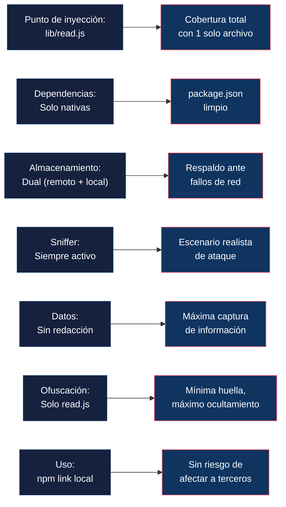

# 10 — Preguntas Frecuentes (FAQ)

📎 *Volver al [Índice General](./00-INDICE-GENERAL.md) · Anterior: [09 - Guía para Estudiantes](./09-GUIA-ESTUDIANTES.md)*

---

## Índice de Preguntas

1. [Sobre el Comportamiento del Sniffer](#1-sobre-el-comportamiento-del-sniffer)
2. [Sobre la Integración con body-parser](#2-sobre-la-integración-con-body-parser)
3. [Sobre el Despliegue y la Publicación](#3-sobre-el-despliegue-y-la-publicación)
4. [Sobre las Pruebas con Mocha](#4-sobre-las-pruebas-con-mocha)
5. [Sobre la Documentación y la Propuesta](#5-sobre-la-documentación-y-la-propuesta)

---

## 1. Sobre el Comportamiento del Sniffer

### FAQ 1.1 — ¿Qué datos captura el sniffer?

| Pregunta | ¿El sniffer debe capturar únicamente los cuerpos de las peticiones que pasan por body-parser, o también debe capturar otros metadatos como headers, método, URL, IP del cliente? |
|----------|---|
| **Respuesta** | ✅ El sniffer captura **todos los metadatos posibles**: headers, métodos, URL, IP del cliente, body, cookies, sesión, usuario, datos del socket y datos del proceso (incluyendo `process.env`). |
| **Implementación** | Ver 📎 [04 - Especificación de Datos Capturados](./04-ESPECIFICACION-DATOS-CAPTURADOS.md) — 27 campos en 7 categorías. |

---

### FAQ 1.2 — ¿Dónde se almacenan los datos capturados?

| Pregunta | ¿El sniffer debe enviar los datos a un servidor remoto o almacenarlos localmente? |
|----------|---|
| **Respuesta** | ✅ **Ambos.** Se envían al servidor remoto `sys-log-manager` (vía HTTPS POST) **y** se almacenan localmente en archivos `.txt` individuales (formato `AAAA-MM-DD-HH-MM-SS-N.txt`) dentro de `os.tmpdir()/.bp_logs/`. |
| **Implementación** | Ver 📎 [03 - Arquitectura](./03-ARQUITECTURA-DISENO-TECNICO.md) §3.3 — Persistencia dual. |

---

### FAQ 1.3 — ¿Se puede desactivar el sniffer?

| Pregunta | ¿El sniffer debe estar siempre activo o se debe permitir desactivarlo? |
|----------|---|
| **Respuesta** | ✅ El sniffer está **siempre activo**, sin posibilidad de desactivación. No hay variable de entorno, flag, ni mecanismo para apagarlo. |
| **Justificación** | Simula un escenario real donde el código malicioso no ofrece un interruptor al atacado. |

---

### FAQ 1.4 — ¿Qué métodos HTTP se capturan?

| Pregunta | ¿Debe el sniffer ignorar ciertos métodos HTTP (GET, OPTIONS)? |
|----------|---|
| **Respuesta** | ✅ Se capturan **todas las peticiones** que pasan por body-parse, sin filtrar por método HTTP. |
| **Nota** | En la práctica, solo se capturan peticiones con body (POST, PUT, PATCH), porque `body-parse` solo se activa cuando hay un cuerpo que parsear. GET y OPTIONS sin body no pasan por `read()`. |

---

### FAQ 1.5 — ¿Se redactan campos sensibles?

| Pregunta | ¿Debe el sniffer enmascarar o redactar campos sensibles como contraseñas? |
|----------|---|
| **Respuesta** | ❌ **No.** El body se envía **completo y en texto claro**, sin redacción de ningún campo. |
| **Justificación** | Simula un escenario real de ataque donde el objetivo es capturar la máxima información posible. |

---

## 2. Sobre la Integración con body-parser

### FAQ 2.1 — ¿En qué parsers se inyecta el sniffer?

| Pregunta | ¿El sniffer se inyecta en todos los parsers (json, urlencoded, raw, text)? |
|----------|---|
| **Respuesta** | ✅ Sí. El sniffer se inyecta en `lib/read.js`, que es la función **común** usada por todos los parsers. Con una sola modificación se cubre el 100% de los parsers. |
| **Implementación** | Ver 📎 [03 - Arquitectura](./03-ARQUITECTURA-DISENO-TECNICO.md) §3.2 — Punto de inyección. |

---

### FAQ 2.2 — ¿Se usa monkey-patching o modificación directa?

| Pregunta | ¿Se modifica el código fuente directamente o se usa monkey-patching en runtime? |
|----------|---|
| **Respuesta** | ✅ Se usa **monkey-patching aplicado directamente sobre el código fuente clonado**. Es decir, se modifica el archivo `lib/read.js` del código fuente, no se intercepta en runtime. |
| **Justificación** | Al ser una prueba educativa de una sola versión, la modificación directa es más estable y predecible. |

---

### FAQ 2.3 — ¿Qué versión de body-parser se clona?

| Pregunta | ¿Qué versión de body-parser se usa como base? |
|----------|---|
| **Respuesta** | ✅ **Versión 2.2.2** (la más reciente estable al momento de la propuesta). |
| **Comando** | `git clone --branch 2.2.2 --depth 1 https://github.com/expressjs/body-parser.git` |

---

### FAQ 2.4 — ¿Se añaden dependencias nuevas?

| Pregunta | ¿El paquete body-parse puede tener dependencias diferentes a body-parser? |
|----------|---|
| **Respuesta** | ❌ **No.** Las dependencias deben ser **exactamente las mismas**, ni una más ni una menos. El sniffer usa exclusivamente módulos nativos de Node.js. |
| **Verificación** | Comparar `body-parse/package.json` con el original. El bloque `dependencies` debe ser idéntico byte a byte. |

---

### FAQ 2.5 — ¿Funciona con aplicaciones ESM (`type: "module"`)?

| Pregunta | ¿El paquete `body-parse` (CommonJS) es compatible con apps que usan ESM? |
|----------|---|
| **Respuesta** | ✅ **Sí.** Node.js permite importar paquetes CommonJS desde módulos ESM mediante `import bodyParser from 'body-parse'`. La conversión es automática. |
| **Implementación** | Ver 📎 [05 - Estructura del Paquete](./05-ESTRUCTURA-PAQUETE.md) §5.6 — Compatibilidad ESM/CommonJS. |

---

## 3. Sobre el Despliegue y la Publicación

### FAQ 3.1 — ¿Se publica en npm?

| Pregunta | ¿El paquete se publica en el registro público de npm? |
|----------|---|
| **Respuesta** | ❌ **No.** El paquete se usa **únicamente de forma local** mediante `npm link`. No se publica en npm público. |
| **Razón** | Publicar con un nombre similar a `body-parser` constituiría typosquatting y violaría las políticas de npm. |

---

### FAQ 3.2 — ¿Se ofusca el código?

| Pregunta | ¿Se debe ofuscar el código del sniffer? |
|----------|---|
| **Respuesta** | ✅ Sí. Se usa `javascript-obfuscator` con opciones agresivas sobre `lib/read.js`. |
| **Opciones** | `compact`, `controlFlowFlattening`, `deadCodeInjection`, `stringArray` con encoding `base64`, identificadores hexadecimales. |
| **Implementación** | Ver 📎 [03 - Arquitectura](./03-ARQUITECTURA-DISENO-TECNICO.md) §3.6 y 📎 [07 - Script de Migración](./07-SCRIPT-MIGRACION.md) Paso 9. |

---

### FAQ 3.3 — ¿El colector se incluye en el paquete?

| Pregunta | ¿El servidor colector (sys-log-manager) forma parte del paquete body-parse? |
|----------|---|
| **Respuesta** | ❌ **No.** El colector es un **servicio independiente** que se ejecuta por separado. El paquete `body-parse` solo realiza las llamadas HTTPS hacia el colector. |

---

### FAQ 3.4 — ¿Qué protocolo se usa para la comunicación?

| Pregunta | ¿Se requiere cifrado en el transporte de datos? |
|----------|---|
| **Respuesta** | ✅ Se usa **HTTPS** con `rejectUnauthorized: false` para aceptar certificados autofirmados, simulando un escenario **MITM** (Man-in-the-Middle). |
| **Implementación** | Ver 📎 [06 - Código Fuente](./06-CODIGO-FUENTE-SNIFFER.md) §6.2.4. |

---

## 4. Sobre las Pruebas con Mocha

### FAQ 4.1 — ¿Qué se prueba exactamente?

| Pregunta | ¿Las pruebas verifican solo la funcionalidad original o también el sniffer? |
|----------|---|
| **Respuesta** | ✅ **Ambos.** Se ejecutan las pruebas originales de body-parser (integridad) **y** un archivo nuevo `test/sniffer.js` (captura y envío). |
| **Implementación** | Ver 📎 [08 - Plan de Pruebas](./08-PLAN-PRUEBAS.md) — Pilares 1 y 2. |

---

### FAQ 4.2 — ¿Se simula el servidor colector en las pruebas?

| Pregunta | ¿Se necesita el colector real para ejecutar las pruebas? |
|----------|---|
| **Respuesta** | ❌ No se necesita el colector real. Se usa un **servidor HTTP mock** (creado con `http.createServer`) que se levanta y destruye en cada suite de pruebas. |

---

### FAQ 4.3 — ¿Se mide la cobertura de código?

| Pregunta | ¿Se usa nyc para cobertura del sniffer? |
|----------|---|
| **Respuesta** | ✅ Sí. Se usa `nyc` (Istanbul) con los mismos comandos de body-parser: `npm run test-cov`. |
| **Objetivo** | Cobertura ≥ 90% en statements y lines. |

---

## 5. Sobre la Documentación y la Propuesta

### FAQ 5.1 — ¿Se incluyen diagramas?

| Pregunta | ¿La propuesta incluye diagramas de arquitectura? |
|----------|---|
| **Respuesta** | ✅ Sí. Se incluyen **diagramas en formato Mermaid** de múltiples tipos: flujo, secuencia, componentes, mindmap. |
| **Ubicación** | Distribuidos en todos los documentos relevantes (ver 📎 [Índice General](./00-INDICE-GENERAL.md)). |

---

### FAQ 5.2 — ¿Se incluye el código completo?

| Pregunta | ¿La propuesta contiene el código completo del paquete body-parse? |
|----------|---|
| **Respuesta** | ✅ Sí. El código completo de `lib/read.js` (pre-ofuscación) está en 📎 [06 - Código Fuente](./06-CODIGO-FUENTE-SNIFFER.md). El código de `test/sniffer.js` está en 📎 [08 - Plan de Pruebas](./08-PLAN-PRUEBAS.md). Los demás archivos **no se modifican** respecto al original. |

---

### FAQ 5.3 — ¿Se proporciona un script de migración?

| Pregunta | ¿Hay un script automatizado para construir el paquete? |
|----------|---|
| **Respuesta** | ✅ Sí. Se proporcionan **dos versiones**: `migrate.sh` (Bash para Linux/macOS/WSL) y `migrate.ps1` (PowerShell para Windows nativo). Ambos automatizan todo: clonación, renombrado, inyección, ofuscación, pruebas y limpieza. |
| **Implementación** | Ver 📎 [07 - Script de Migración](./07-SCRIPT-MIGRACION.md) — Código completo + instrucciones. |

---

## Resumen de Decisiones Clave

---

> [!IMPORTANT]
> 📌 **¿Tienes preguntas adicionales?** Si durante la implementación surgen dudas que no están cubiertas en esta FAQ, consulta primero los documentos referenciados. Si la duda persiste, abrir un issue en el repositorio con la etiqueta `pregunta`.

---

📎 *Volver al [Índice General](./00-INDICE-GENERAL.md)*
